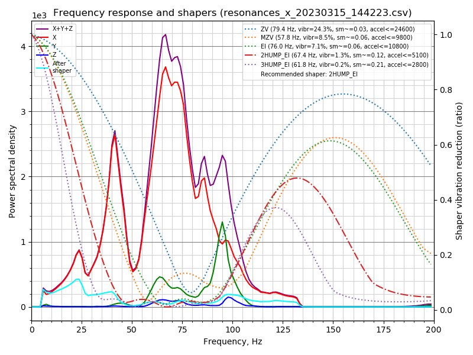
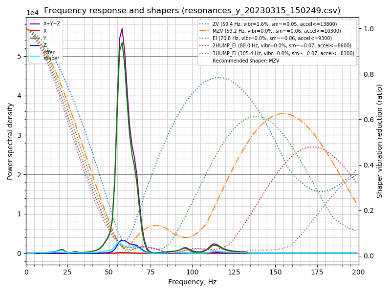

# Ender 5 S1

My Documentation, Configuration, Scripts and notes for the Ender 5 S1 3d Printer.

# Sam's Ender 5 S1 Setup

## Hardware

- Ender 5 S1

### Upgrades

#### Future Upgrades

Potential future upgrades

- [Squirrelf](https://t.co/BVAAPdqH7z)'s ApolloLander cooling <https://www.patreon.com/posts/apollolander-and-71090737>
- ADXL345 accelerometer
- Linear rails (expensive though!)

## Firmware

## Feedrate calibration

### Creality Sprite (Stock)

## Resonance Testing



```plain
/usr/share/klipper/scripts/calibrate_shaper.py resonances_x_*.csv -o shaper_calibrate_x.png

Fitted shaper 'zv' frequency = 79.4 Hz (vibrations = 24.3%, smoothing ~= 0.031)
To avoid too much smoothing with 'zv', suggested max_accel <= 24600 mm/sec^2
Fitted shaper 'mzv' frequency = 57.8 Hz (vibrations = 8.5%, smoothing ~= 0.061)
To avoid too much smoothing with 'mzv', suggested max_accel <= 9800 mm/sec^2
Fitted shaper 'ei' frequency = 76.0 Hz (vibrations = 7.1%, smoothing ~= 0.056)
To avoid too much smoothing with 'ei', suggested max_accel <= 10800 mm/sec^2
Fitted shaper '2hump_ei' frequency = 67.4 Hz (vibrations = 1.3%, smoothing ~= 0.119)
To avoid too much smoothing with '2hump_ei', suggested max_accel <= 5100 mm/sec^2
Fitted shaper '3hump_ei' frequency = 61.8 Hz (vibrations = 0.2%, smoothing ~= 0.215)
To avoid too much smoothing with '3hump_ei', suggested max_accel <= 2800 mm/sec^2
Recommended shaper is 2hump_ei @ 67.4 Hz
```



```plain
/usr/share/klipper/scripts/calibrate_shaper.py resonances_y_*.csv -o shaper_calibrate_y.png

Fitted shaper 'zv' frequency = 59.4 Hz (vibrations = 1.6%, smoothing ~= 0.050)
To avoid too much smoothing with 'zv', suggested max_accel <= 13800 mm/sec^2
Fitted shaper 'mzv' frequency = 59.2 Hz (vibrations = 0.0%, smoothing ~= 0.058)
To avoid too much smoothing with 'mzv', suggested max_accel <= 10300 mm/sec^2
Fitted shaper 'ei' frequency = 70.8 Hz (vibrations = 0.0%, smoothing ~= 0.064)
To avoid too much smoothing with 'ei', suggested max_accel <= 9300 mm/sec^2
Fitted shaper '2hump_ei' frequency = 88.0 Hz (vibrations = 0.0%, smoothing ~= 0.070)
To avoid too much smoothing with '2hump_ei', suggested max_accel <= 8600 mm/sec^2
Fitted shaper '3hump_ei' frequency = 105.4 Hz (vibrations = 0.0%, smoothing ~= 0.074)
To avoid too much smoothing with '3hump_ei', suggested max_accel <= 8100 mm/sec^2
Recommended shaper is mzv @ 59.2 Hz
```
