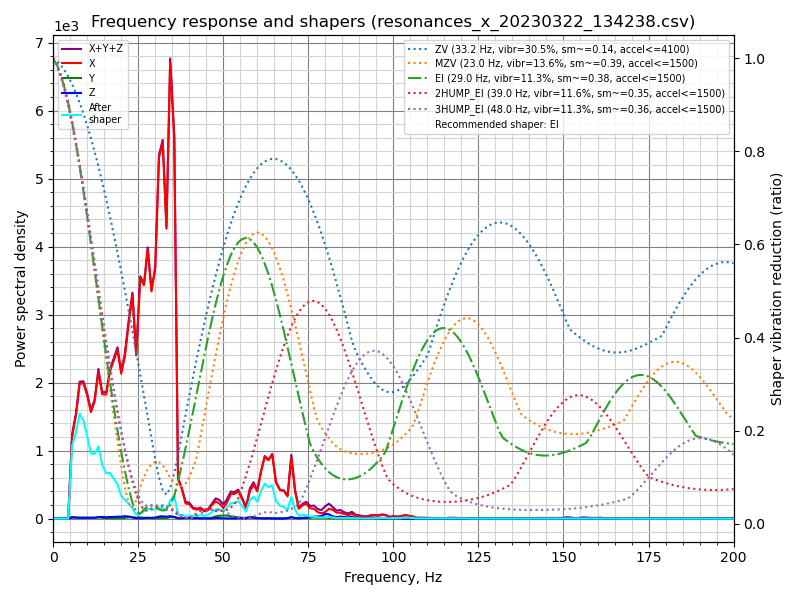
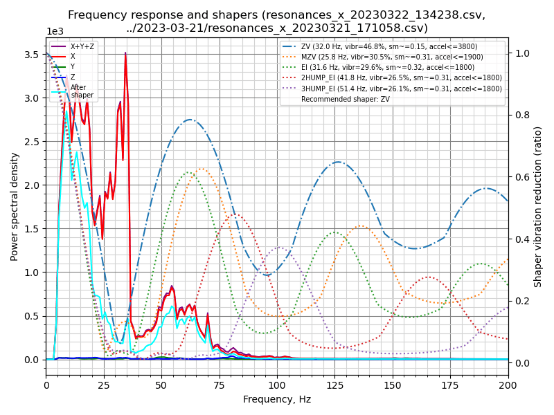
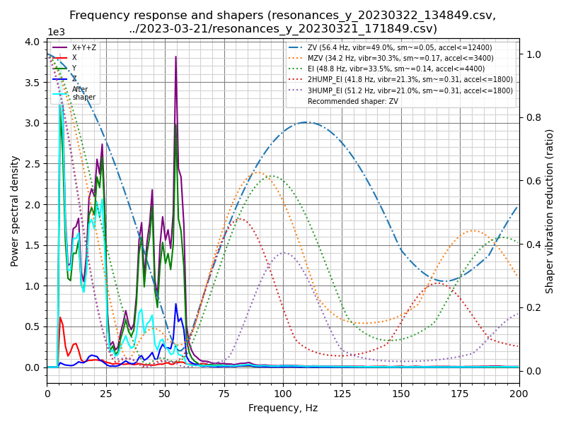
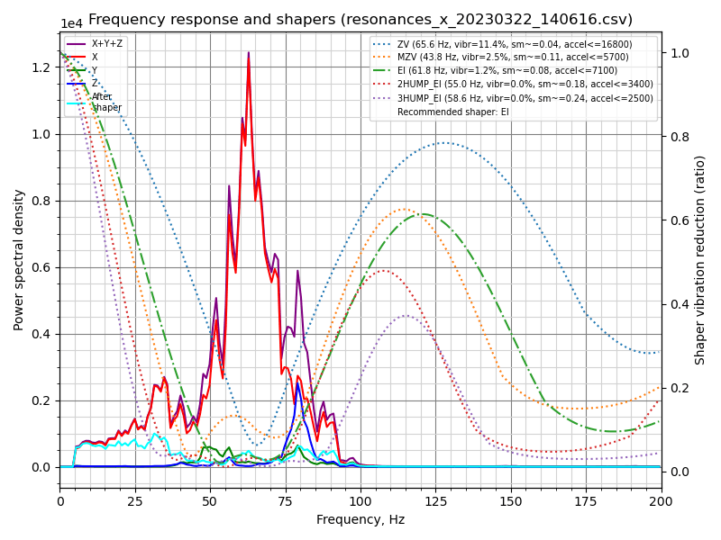
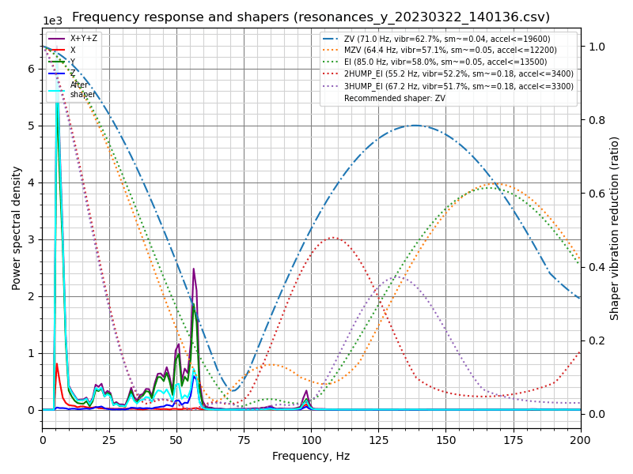
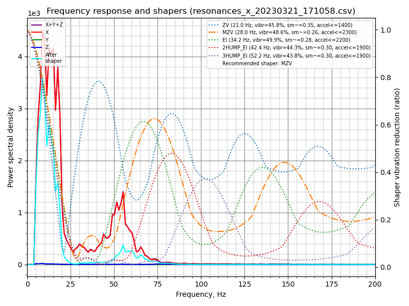
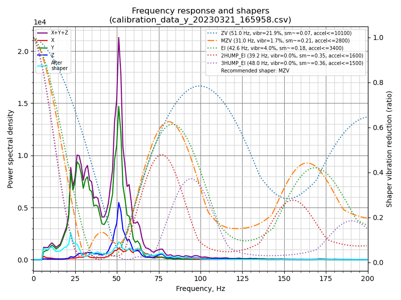

# Ender 5 S1

My Documentation, Configuration, Scripts and notes for the Ender 5 S1 3d Printer.

# Sam's Ender 5 S1 Setup

- [Ender 5 S1](#ender-5-s1)
- [Sam's Ender 5 S1 Setup](#sams-ender-5-s1-setup)
  - [Hardware](#hardware)
  - [Firmware](#firmware)
  - [Feedrate calibration](#feedrate-calibration)
    - [Creality Sprite (Stock)](#creality-sprite-stock)
  - [Pressure Advance](#pressure-advance)
    - [2023-03-29](#2023-03-29)
  - [Resonance Testing](#resonance-testing)
    - [2023-03-29](#2023-03-29-1)
    - [2023-03-28](#2023-03-28)
    - [2023-03-27](#2023-03-27)
    - [2023-03-24](#2023-03-24)
    - [2023-03-22](#2023-03-22)
      - [Test 1](#test-1)
      - [Test 2](#test-2)
    - [2023-03-21](#2023-03-21)
    - [2023-03-15](#2023-03-15)
  - [Shrinkage Calibration](#shrinkage-calibration)
    - [2023-03-23](#2023-03-23)
  - [Notes / Links](#notes--links)
    - [Controller board](#controller-board)
    - [Variant](#variant)

## Hardware

- Ender 5 S1
- Creality Sprite Extruder
- Micro Swiss all metal hotend
- 60W heating element
- 2x KUSBA ADXL345 USB accelerometers

## Firmware

- Klipper

## Feedrate calibration

### Creality Sprite (Stock)

- The large heatsink used on the 2023 Ender 5 S1 is exactly the same as on the 2022 Ender 3 V2 Neo with one exception - it comes with a bi-metal heatbreak.

## Pressure Advance

### 2023-03-29

- 0.6mm nozzle
- 0.44mm layer height

Corners look best about 8.4mm

> pressure_advance = <start> + <measured_height> * <factor>

PA = 0 + 8.4 * 0.005 == 0.042

## Resonance Testing

```plain
MEASURE_AXES_NOISE # (0~100 and < 1000)
TEST_RESONANCES AXIS=X
MEASURE_AXES_NOISE # (0~100 and < 1000)
TEST_RESONANCES AXIS=Y
mkdir -p ~/calibration/$(date +%Y%m%d) && mv /tmp/resonances_*$(date +%Y%m%d)* ~/calibration/$(date +%Y%m%d)

cd  ~/calibration/$(date +%Y%m%d)
~/klipper/scripts/calibrate_shaper.py resonances_x*.csv -o resonances_x_$(date +%Y%m%d).png
~/klipper/scripts/calibrate_shaper.py resonances_y*.csv -o resonances_y_$(date +%Y%m%d).png
```

### 2023-03-29

- Reseated enclosure to reduced rattling

- X: Recommended shaper is mzv @ 65.6 Hz - suggested max_accel <= 12700 mm/sec^2
- Y: Recommended shaper is 3hump_ei @ 65.8 Hz - suggested max_accel <= 3200 mm/sec^2

```plain
Fitted shaper 'zv' frequency = 69.0 Hz (vibrations = 2.2%, smoothing ~= 0.039)
To avoid too much smoothing with 'zv', suggested max_accel <= 18600 mm/sec^2
Fitted shaper 'mzv' frequency = 65.6 Hz (vibrations = 0.2%, smoothing ~= 0.048)
To avoid too much smoothing with 'mzv', suggested max_accel <= 12700 mm/sec^2
Fitted shaper 'ei' frequency = 73.2 Hz (vibrations = 0.0%, smoothing ~= 0.060)
To avoid too much smoothing with 'ei', suggested max_accel <= 10000 mm/sec^2
Fitted shaper '2hump_ei' frequency = 94.8 Hz (vibrations = 0.0%, smoothing ~= 0.061)
To avoid too much smoothing with '2hump_ei', suggested max_accel <= 10000 mm/sec^2
Fitted shaper '3hump_ei' frequency = 117.6 Hz (vibrations = 0.0%, smoothing ~= 0.060)
To avoid too much smoothing with '3hump_ei', suggested max_accel <= 10100 mm/sec^2
Recommended shaper is mzv @ 65.6 Hz
```

```plain
Fitted shaper 'zv' frequency = 34.4 Hz (vibrations = 27.8%, smoothing ~= 0.132)
To avoid too much smoothing with 'zv', suggested max_accel <= 4500 mm/sec^2
Fitted shaper 'mzv' frequency = 24.0 Hz (vibrations = 9.7%, smoothing ~= 0.354)
To avoid too much smoothing with 'mzv', suggested max_accel <= 1600 mm/sec^2
Fitted shaper 'ei' frequency = 31.8 Hz (vibrations = 8.6%, smoothing ~= 0.319)
To avoid too much smoothing with 'ei', suggested max_accel <= 1900 mm/sec^2
Fitted shaper '2hump_ei' frequency = 39.0 Hz (vibrations = 6.6%, smoothing ~= 0.355)
To avoid too much smoothing with '2hump_ei', suggested max_accel <= 1500 mm/sec^2
Fitted shaper '3hump_ei' frequency = 65.8 Hz (vibrations = 4.1%, smoothing ~= 0.189)
To avoid too much smoothing with '3hump_ei', suggested max_accel <= 3200 mm/sec^2
Recommended shaper is 3hump_ei @ 65.8 Hz
```

### 2023-03-28

- 2x KUSBA USB ADXL345 installed (one on bed)

- X: Recommended shaper is mzv @ 65.8 Hz, suggested max_accel <= 12800 mm/sec^2
- Y: Recommended shaper is 3hump_ei @ 62.6 Hz, suggested max_accel <= 2900 mm/sec^2

```plain
Fitted shaper 'zv' frequency = 69.2 Hz (vibrations = 2.0%, smoothing ~= 0.039)
To avoid too much smoothing with 'zv', suggested max_accel <= 18700 mm/sec^2
Fitted shaper 'mzv' frequency = 65.8 Hz (vibrations = 0.3%, smoothing ~= 0.048)
To avoid too much smoothing with 'mzv', suggested max_accel <= 12800 mm/sec^2
Fitted shaper 'ei' frequency = 72.8 Hz (vibrations = 0.0%, smoothing ~= 0.061)
To avoid too much smoothing with 'ei', suggested max_accel <= 9900 mm/sec^2
Fitted shaper '2hump_ei' frequency = 94.2 Hz (vibrations = 0.0%, smoothing ~= 0.062)
To avoid too much smoothing with '2hump_ei', suggested max_accel <= 9900 mm/sec^2
Fitted shaper '3hump_ei' frequency = 116.8 Hz (vibrations = 0.0%, smoothing ~= 0.061)
To avoid too much smoothing with '3hump_ei', suggested max_accel <= 10000 mm/sec^2
Recommended shaper is mzv @ 65.8 Hz
```

```plain
Fitted shaper 'zv' frequency = 33.2 Hz (vibrations = 23.5%, smoothing ~= 0.140)
To avoid too much smoothing with 'zv', suggested max_accel <= 4100 mm/sec^2
Fitted shaper 'mzv' frequency = 26.0 Hz (vibrations = 9.2%, smoothing ~= 0.301)
To avoid too much smoothing with 'mzv', suggested max_accel <= 2000 mm/sec^2
Fitted shaper 'ei' frequency = 34.2 Hz (vibrations = 8.3%, smoothing ~= 0.275)
To avoid too much smoothing with 'ei', suggested max_accel <= 2200 mm/sec^2
Fitted shaper '2hump_ei' frequency = 39.0 Hz (vibrations = 4.3%, smoothing ~= 0.355)
To avoid too much smoothing with '2hump_ei', suggested max_accel <= 1500 mm/sec^2
Fitted shaper '3hump_ei' frequency = 62.6 Hz (vibrations = 4.6%, smoothing ~= 0.209)
To avoid too much smoothing with '3hump_ei', suggested max_accel <= 2900 mm/sec^2
Recommended shaper is 3hump_ei @ 62.6 Hz
```

### 2023-03-27

- 1x KUSBA USB ADXL345 installed

```plain
Fitted shaper 'zv' frequency = 69.6 Hz (vibrations = 1.7%, smoothing ~= 0.038)
To avoid too much smoothing with 'zv', suggested max_accel <= 18900 mm/sec^2
Fitted shaper 'mzv' frequency = 66.0 Hz (vibrations = 0.4%, smoothing ~= 0.048)
To avoid too much smoothing with 'mzv', suggested max_accel <= 12800 mm/sec^2
Fitted shaper 'ei' frequency = 69.6 Hz (vibrations = 0.0%, smoothing ~= 0.066)
To avoid too much smoothing with 'ei', suggested max_accel <= 9000 mm/sec^2
Fitted shaper '2hump_ei' frequency = 89.6 Hz (vibrations = 0.0%, smoothing ~= 0.067)
To avoid too much smoothing with '2hump_ei', suggested max_accel <= 8900 mm/sec^2
Fitted shaper '3hump_ei' frequency = 110.8 Hz (vibrations = 0.0%, smoothing ~= 0.067)
To avoid too much smoothing with '3hump_ei', suggested max_accel <= 9000 mm/sec^2
Recommended shaper is zv @ 69.6 Hz
```

```plain
Fitted shaper 'zv' frequency = 60.2 Hz (vibrations = 34.2%, smoothing ~= 0.049)
To avoid too much smoothing with 'zv', suggested max_accel <= 14100 mm/sec^2
Fitted shaper 'mzv' frequency = 36.4 Hz (vibrations = 9.3%, smoothing ~= 0.154)
To avoid too much smoothing with 'mzv', suggested max_accel <= 3900 mm/sec^2
Fitted shaper 'ei' frequency = 49.4 Hz (vibrations = 10.7%, smoothing ~= 0.132)
To avoid too much smoothing with 'ei', suggested max_accel <= 4500 mm/sec^2
Fitted shaper '2hump_ei' frequency = 44.4 Hz (vibrations = 2.6%, smoothing ~= 0.274)
To avoid too much smoothing with '2hump_ei', suggested max_accel <= 2100 mm/sec^2
Fitted shaper '3hump_ei' frequency = 52.6 Hz (vibrations = 0.6%, smoothing ~= 0.296)
To avoid too much smoothing with '3hump_ei', suggested max_accel <= 1900 mm/sec^2
Recommended shaper is 3hump_ei @ 52.6 Hz
```

### 2023-03-24

Added enclosure.

```plain
Fitted shaper 'zv' frequency = 23.2 Hz (vibrations = 58.3%, smoothing ~= 0.286)
To avoid too much smoothing with 'zv', suggested max_accel <= 1800 mm/sec^2
Fitted shaper 'mzv' frequency = 25.4 Hz (vibrations = 54.2%, smoothing ~= 0.316)
To avoid too much smoothing with 'mzv', suggested max_accel <= 1800 mm/sec^2
Fitted shaper 'ei' frequency = 31.8 Hz (vibrations = 54.1%, smoothing ~= 0.319)
To avoid too much smoothing with 'ei', suggested max_accel <= 1900 mm/sec^2
Fitted shaper '2hump_ei' frequency = 43.4 Hz (vibrations = 54.2%, smoothing ~= 0.286)
To avoid too much smoothing with '2hump_ei', suggested max_accel <= 2000 mm/sec^2
Fitted shaper '3hump_ei' frequency = 53.2 Hz (vibrations = 53.3%, smoothing ~= 0.290)
To avoid too much smoothing with '3hump_ei', suggested max_accel <= 2000 mm/sec^2
Recommended shaper is zv @ 23.2 Hz
```

```plain
Fitted shaper 'zv' frequency = 45.4 Hz (vibrations = 23.8%, smoothing ~= 0.080)
To avoid too much smoothing with 'zv', suggested max_accel <= 8000 mm/sec^2
Fitted shaper 'mzv' frequency = 41.0 Hz (vibrations = 4.4%, smoothing ~= 0.121)
To avoid too much smoothing with 'mzv', suggested max_accel <= 5000 mm/sec^2
Fitted shaper 'ei' frequency = 52.6 Hz (vibrations = 7.6%, smoothing ~= 0.116)
To avoid too much smoothing with 'ei', suggested max_accel <= 5200 mm/sec^2
Fitted shaper '2hump_ei' frequency = 54.2 Hz (vibrations = 0.1%, smoothing ~= 0.184)
To avoid too much smoothing with '2hump_ei', suggested max_accel <= 3300 mm/sec^2
Fitted shaper '3hump_ei' frequency = 63.4 Hz (vibrations = 0.0%, smoothing ~= 0.204)
To avoid too much smoothing with '3hump_ei', suggested max_accel <= 2900 mm/sec^2
Recommended shaper is 2hump_ei @ 54.2 Hz
```

### 2023-03-22

Updated from 4x squash ball feet to 6x - no other changes.

#### Test 1

- X - Recommended shaper is ei @ 29.0 Hz (max_accel = 1500 mm/sec^2)
- Y - Recommended shaper is zv @ 55.8 Hz (max_accel = 12100 mm/sec^2)




```plain
~/klipper/scripts/calibrate_shaper.py resonances_x_20230322_134238.csv -o resonances_x_20230322_134238.png
Fitted shaper 'zv' frequency = 33.2 Hz (vibrations = 30.5%, smoothing ~= 0.140)
To avoid too much smoothing with 'zv', suggested max_accel <= 4100 mm/sec^2
Fitted shaper 'mzv' frequency = 23.0 Hz (vibrations = 13.6%, smoothing ~= 0.385)
To avoid too much smoothing with 'mzv', suggested max_accel <= 1500 mm/sec^2
Fitted shaper 'ei' frequency = 29.0 Hz (vibrations = 11.3%, smoothing ~= 0.383)
To avoid too much smoothing with 'ei', suggested max_accel <= 1500 mm/sec^2
Fitted shaper '2hump_ei' frequency = 39.0 Hz (vibrations = 11.6%, smoothing ~= 0.355)
To avoid too much smoothing with '2hump_ei', suggested max_accel <= 1500 mm/sec^2
Fitted shaper '3hump_ei' frequency = 48.0 Hz (vibrations = 11.3%, smoothing ~= 0.356)
To avoid too much smoothing with '3hump_ei', suggested max_accel <= 1500 mm/sec^2
Recommended shaper is ei @ 29.0 Hz
```

```plain
~/klipper/scripts/calibrate_shaper.py resonances_y_20230322_134849.csv -o resonances_y_20230322.png
Fitted shaper 'zv' frequency = 55.8 Hz (vibrations = 42.2%, smoothing ~= 0.056)
To avoid too much smoothing with 'zv', suggested max_accel <= 12100 mm/sec^2
Fitted shaper 'mzv' frequency = 33.4 Hz (vibrations = 22.1%, smoothing ~= 0.183)
To avoid too much smoothing with 'mzv', suggested max_accel <= 3300 mm/sec^2
Fitted shaper 'ei' frequency = 47.6 Hz (vibrations = 25.5%, smoothing ~= 0.142)
To avoid too much smoothing with 'ei', suggested max_accel <= 4200 mm/sec^2
Fitted shaper '2hump_ei' frequency = 39.4 Hz (vibrations = 11.7%, smoothing ~= 0.348)
To avoid too much smoothing with '2hump_ei', suggested max_accel <= 1600 mm/sec^2
Fitted shaper '3hump_ei' frequency = 48.0 Hz (vibrations = 11.2%, smoothing ~= 0.356)
To avoid too much smoothing with '3hump_ei', suggested max_accel <= 1500 mm/sec^2
Recommended shaper is zv @ 55.8 Hz
```

##### Combining yesterdays and today's data




- X - Recommended shaper is zv @ 32.0 Hz (max_accel = 3800 mm/sec^2)
- Y - Recommended shaper is zv @ 56.4 Hz (max_accel = 12400 mm/sec^2)

#### Test 2

Bed and Hotend at 50deg.




- X - Recommended shaper is ei @ 61.8 Hz (max_accel = 7100 mm/sec^2)
- Y - Recommended shaper is zv @ 71.0 Hz (max_accel = 19600 mm/sec^2)

```plain
 ~/klipper/scripts/calibrate_shaper.py resonances_x*.csv -o resonances_x_20230322_02.png
Fitted shaper 'zv' frequency = 65.6 Hz (vibrations = 11.4%, smoothing ~= 0.042)
To avoid too much smoothing with 'zv', suggested max_accel <= 16800 mm/sec^2
Fitted shaper 'mzv' frequency = 43.8 Hz (vibrations = 2.5%, smoothing ~= 0.106)
To avoid too much smoothing with 'mzv', suggested max_accel <= 5700 mm/sec^2
Fitted shaper 'ei' frequency = 61.8 Hz (vibrations = 1.2%, smoothing ~= 0.084)
To avoid too much smoothing with 'ei', suggested max_accel <= 7100 mm/sec^2
Fitted shaper '2hump_ei' frequency = 55.0 Hz (vibrations = 0.0%, smoothing ~= 0.178)
To avoid too much smoothing with '2hump_ei', suggested max_accel <= 3400 mm/sec^2
Fitted shaper '3hump_ei' frequency = 58.6 Hz (vibrations = 0.0%, smoothing ~= 0.239)
To avoid too much smoothing with '3hump_ei', suggested max_accel <= 2500 mm/sec^2
Recommended shaper is ei @ 61.8 Hz
```

```plain
~/klipper/scripts/calibrate_shaper.py resonances_y*.csv -o resonances_y_20230322_02.png
Fitted shaper 'zv' frequency = 71.0 Hz (vibrations = 62.7%, smoothing ~= 0.037)
To avoid too much smoothing with 'zv', suggested max_accel <= 19600 mm/sec^2
Fitted shaper 'mzv' frequency = 64.4 Hz (vibrations = 57.1%, smoothing ~= 0.050)
To avoid too much smoothing with 'mzv', suggested max_accel <= 12200 mm/sec^2
Fitted shaper 'ei' frequency = 85.0 Hz (vibrations = 58.0%, smoothing ~= 0.045)
To avoid too much smoothing with 'ei', suggested max_accel <= 13500 mm/sec^2
Fitted shaper '2hump_ei' frequency = 55.2 Hz (vibrations = 52.2%, smoothing ~= 0.177)
To avoid too much smoothing with '2hump_ei', suggested max_accel <= 3400 mm/sec^2
Fitted shaper '3hump_ei' frequency = 67.2 Hz (vibrations = 51.7%, smoothing ~= 0.181)
To avoid too much smoothing with '3hump_ei', suggested max_accel <= 3300 mm/sec^2
Recommended shaper is zv @ 71.0 Hz
```

### 2023-03-21

Note: This is using my new ADXL245 accelerometer with my own dodgy wiring - may not be perfect.

```plain
shaper_type_x = zv
shaper_freq_x = 21.0
shaper_type_y = mzv
shaper_freq_y = 31.0
```

- [calibration data](calibration/)

- X
  - Resonances
    - Recommended shaper is mzv @ 28.0 Hz
      - To avoid too much smoothing with 'mzv', suggested max_accel <= 2300 mm/sec^2
  - Shaper
    - Recommended shaper_type_x = zv, shaper_freq_x = 21.0 Hz
      - To avoid too much smoothing with 'zv', suggested max_accel <= 1400 mm/sec^2
- Y
  - Resonances
    - Recommended shaper is zv @ 32.6 Hz
      - To avoid too much smoothing with 'zv', suggested max_accel <= 3900 mm/sec^2
  - Shaper
    - Recommended shaper_type_y = mzv, shaper_freq_y = 31.0 Hz
      - To avoid too much smoothing with 'mzv', suggested max_accel <= 2800 mm/sec^2

TEST_RESONANCES:

```plain
max_accel = 2300

shaper_type_x = mzv
shaper_freq_x = 28.0
shaper_type_y = vz
shaper_freq_y = 32.6
```

SHAPER_CALIBRATE:

```plain
max_accel = 1400

shaper_type_x = zv
shaper_freq_x = 21.0
shaper_type_y = mzv
shaper_freq_y = 31.0
```






```plain
Shaper calibration data written to /tmp/calibration_data_y_20230321_165958.csv file
Recommended shaper_type_y = mzv, shaper_freq_y = 31.0 Hz
To avoid too much smoothing with '3hump_ei', suggested max_accel <= 1500 mm/sec^2
Fitted shaper '3hump_ei' frequency = 48.0 Hz (vibrations = 0.0%, smoothing ~= 0.356)
To avoid too much smoothing with '2hump_ei', suggested max_accel <= 1600 mm/sec^2
Fitted shaper '2hump_ei' frequency = 39.2 Hz (vibrations = 0.0%, smoothing ~= 0.351)
To avoid too much smoothing with 'ei', suggested max_accel <= 3400 mm/sec^2
Fitted shaper 'ei' frequency = 42.6 Hz (vibrations = 4.0%, smoothing ~= 0.178)
To avoid too much smoothing with 'mzv', suggested max_accel <= 2800 mm/sec^2
Fitted shaper 'mzv' frequency = 31.0 Hz (vibrations = 1.7%, smoothing ~= 0.212)
To avoid too much smoothing with 'zv', suggested max_accel <= 10200 mm/sec^2
Fitted shaper 'zv' frequency = 51.2 Hz (vibrations = 22.1%, smoothing ~= 0.065)
Calculating the best input shaper parameters for y axis
```

```plain
Shaper calibration data written to /tmp/calibration_data_x_20230321_165958.csv file
Recommended shaper_type_x = zv, shaper_freq_x = 21.0 Hz
To avoid too much smoothing with '3hump_ei', suggested max_accel <= 1500 mm/sec^2
Fitted shaper '3hump_ei' frequency = 48.0 Hz (vibrations = 27.3%, smoothing ~= 0.356)
To avoid too much smoothing with '2hump_ei', suggested max_accel <= 1500 mm/sec^2
Fitted shaper '2hump_ei' frequency = 39.0 Hz (vibrations = 27.6%, smoothing ~= 0.355)
To avoid too much smoothing with 'ei', suggested max_accel <= 1500 mm/sec^2
Fitted shaper 'ei' frequency = 29.0 Hz (vibrations = 32.6%, smoothing ~= 0.383)
To avoid too much smoothing with 'mzv', suggested max_accel <= 1700 mm/sec^2
Fitted shaper 'mzv' frequency = 24.8 Hz (vibrations = 34.7%, smoothing ~= 0.331)
To avoid too much smoothing with 'zv', suggested max_accel <= 1400 mm/sec^2
Fitted shaper 'zv' frequency = 21.0 Hz (vibrations = 28.9%, smoothing ~= 0.349)
Calculating the best input shaper parameters for x axis
```

`TEST_RESONANCES AXIS=X`

```plain
~/klipper/scripts/calibrate_shaper.py resonances_x_*.csv -o resonances_x.png
Fitted shaper 'zv' frequency = 21.0 Hz (vibrations = 45.8%, smoothing ~= 0.349)
To avoid too much smoothing with 'zv', suggested max_accel <= 1400 mm/sec^2
Fitted shaper 'mzv' frequency = 28.0 Hz (vibrations = 48.6%, smoothing ~= 0.260)
To avoid too much smoothing with 'mzv', suggested max_accel <= 2300 mm/sec^2
Fitted shaper 'ei' frequency = 34.2 Hz (vibrations = 49.9%, smoothing ~= 0.275)
To avoid too much smoothing with 'ei', suggested max_accel <= 2200 mm/sec^2
Fitted shaper '2hump_ei' frequency = 42.4 Hz (vibrations = 44.3%, smoothing ~= 0.300)
To avoid too much smoothing with '2hump_ei', suggested max_accel <= 1900 mm/sec^2
Fitted shaper '3hump_ei' frequency = 52.2 Hz (vibrations = 43.8%, smoothing ~= 0.301)
To avoid too much smoothing with '3hump_ei', suggested max_accel <= 1900 mm/sec^2
Recommended shaper is mzv @ 28.0 Hz
```

`TEST_RESONANCES AXIS=Y`

```plain
~/klipper/scripts/calibrate_shaper.py resonances_y_*.csv -o resonances_y.png
Fitted shaper 'zv' frequency = 32.6 Hz (vibrations = 87.1%, smoothing ~= 0.145)
To avoid too much smoothing with 'zv', suggested max_accel <= 3900 mm/sec^2
Fitted shaper 'mzv' frequency = 33.2 Hz (vibrations = 84.7%, smoothing ~= 0.185)
To avoid too much smoothing with 'mzv', suggested max_accel <= 3200 mm/sec^2
Fitted shaper 'ei' frequency = 41.6 Hz (vibrations = 84.3%, smoothing ~= 0.186)
To avoid too much smoothing with 'ei', suggested max_accel <= 3200 mm/sec^2
Fitted shaper '2hump_ei' frequency = 57.0 Hz (vibrations = 84.5%, smoothing ~= 0.166)
To avoid too much smoothing with '2hump_ei', suggested max_accel <= 3600 mm/sec^2
Fitted shaper '3hump_ei' frequency = 69.2 Hz (vibrations = 83.8%, smoothing ~= 0.171)
To avoid too much smoothing with '3hump_ei', suggested max_accel <= 3500 mm/sec^2
Recommended shaper is zv @ 32.6 Hz
```

### 2023-03-15


```plain
/usr/share/klipper/scripts/calibrate_shaper.py resonances_x_*.csv -o resonances_x.png

Fitted shaper 'zv' frequency = 79.4 Hz (vibrations = 24.3%, smoothing ~= 0.031)
To avoid too much smoothing with 'zv', suggested max_accel <= 24600 mm/sec^2
Fitted shaper 'mzv' frequency = 57.8 Hz (vibrations = 8.5%, smoothing ~= 0.061)
To avoid too much smoothing with 'mzv', suggested max_accel <= 9800 mm/sec^2
Fitted shaper 'ei' frequency = 76.0 Hz (vibrations = 7.1%, smoothing ~= 0.056)
To avoid too much smoothing with 'ei', suggested max_accel <= 10800 mm/sec^2
Fitted shaper '2hump_ei' frequency = 67.4 Hz (vibrations = 1.3%, smoothing ~= 0.119)
To avoid too much smoothing with '2hump_ei', suggested max_accel <= 5100 mm/sec^2
Fitted shaper '3hump_ei' frequency = 61.8 Hz (vibrations = 0.2%, smoothing ~= 0.215)
To avoid too much smoothing with '3hump_ei', suggested max_accel <= 2800 mm/sec^2
Recommended shaper is 2hump_ei @ 67.4 Hz
```


```plain
/usr/share/klipper/scripts/calibrate_shaper.py resonances_y_*.csv -o resonances_y.png

Fitted shaper 'zv' frequency = 59.4 Hz (vibrations = 1.6%, smoothing ~= 0.050)
To avoid too much smoothing with 'zv', suggested max_accel <= 13800 mm/sec^2
Fitted shaper 'mzv' frequency = 59.2 Hz (vibrations = 0.0%, smoothing ~= 0.058)
To avoid too much smoothing with 'mzv', suggested max_accel <= 10300 mm/sec^2
Fitted shaper 'ei' frequency = 70.8 Hz (vibrations = 0.0%, smoothing ~= 0.064)
To avoid too much smoothing with 'ei', suggested max_accel <= 9300 mm/sec^2
Fitted shaper '2hump_ei' frequency = 88.0 Hz (vibrations = 0.0%, smoothing ~= 0.070)
To avoid too much smoothing with '2hump_ei', suggested max_accel <= 8600 mm/sec^2
Fitted shaper '3hump_ei' frequency = 105.4 Hz (vibrations = 0.0%, smoothing ~= 0.074)
To avoid too much smoothing with '3hump_ei', suggested max_accel <= 8100 mm/sec^2
Recommended shaper is mzv @ 59.2 Hz
```

## Shrinkage Calibration

### 2023-03-23

[YACS2mini](https://www.thingiverse.com/thing:5332053)

- X=79.8
- Y=39.9

- S=(78.8-39.9)2.5=97.25% - shrinkage %
  - Take inverse of this one and scale models by this amount
  - Prusaslicer: Advanced Settings -> Scale -> XY Size Compensation
  - Cura: Horizontal Expansion
- E=(97.25-(1.25*79.8))/2=-1.25mm - horizontal expansion mm
  - Use this number directly in slicer

Length AC = 112.6
Length BD = 112.7
Length AD = 79.8

[A/X/Y/Z](https://www.thingiverse.com/thing:2972743)

XY AC = 69.7
XY BD = 70.2
XY AD = 50.2

Very confusing to get the other two Axis, gave up.

[cube skew](https://www.thingiverse.com/thing:5031020)

> Step 1: Measure diagonals AC, BD and AD of each cube side.
> For the XY plane, measure he diagonals when looking at the Z face.
> For the XZ plane, measure he diagonals when looking at the X face.
> For the YZ plane, measure he diagonals when looking at the Y face.
>
> Step 2: In configuration.h there are 3 options mentioned:
>
>      insert the lengths of diagonals for XY, XZ and YZ planes directly in configuration.h and Marlin will calculate the skew >      factors (parameters XY_DIAG_AC, XY_DIAG_BD, XY_SIDE_AD, XZ_DIAG_AC, XZ_DIAG_BD, YZ_DIAG_AC, YZ_DIAG_BD, YZ_SIDE_AD)
>      calculate the skew factors for the 3 planes by hand and insert the values in configuration.h (parameters XY_SKEW_FACTOR, >      XZ_SKEW_FACTOR, YZ_SKEW_FACTOR)
>      calculate the skew factors for the 3 planes by hand and activate SKEW_CORRECTION_GCODE. This way, the skew factors can be >      set via M852 g-code command via serial interface.

XY AC 38.2
XY BD 38.2
XY AD 30

XZ AC 38.4
XZ BD 38.2
XZ AD 30

YZ AC 38.2
YZ BD 38.2
YZ AD 30

SET_SKEW XY=38.2,38.2,30 XZ=38.4,38.2,30 YZ=38.2,38.2,30

## Notes / Links

### Controller board

**Note: The Sprite Extruder / Pro kits have different breakout boards to the Ender 5 S1!**

Below contains notes/reference only.

- Sprite Extruder (Pro) pinout: <https://manuals.plus/creality/sprite-extruder-pro-kit-manual>

Likely an updated version of the board found on the Ender 3 S1, but using the STM32F401RE instead of the STM32F401CC as found in the Ender-3 S1/Ender-3S1 Pro V2.4.S1 Silent MotherBoard

- Marlin Firmware PR to add Ender 5 S1: <https://github.com/MarlinFirmware/Marlin/pull/25382/files>
  - See also <https://github.com/MarlinFirmware/Configurations/blob/import-2.1.x/config/examples/Creality/Ender-5%20S1/>

Below contains extracts of this PR that may be useful to reference.

```plain
* 14 : 100kΩ (R25), 4092K (beta25), 4.7kΩ pull-up, bed thermistor as used in Ender-5 S1
#define BOARD_CREALITY_F401RE 5246 // Creality CR4NS200141C13 (STM32F401RE)
#define SCREEN_HW_VERSION "DWIN20220915"
#define HARDWARE_VERSION  "CR4NS200141C13"
```

Pins for Marlin

```plain

/**
 * Logical pin vs. port/pin cross reference
 *
 * PA0  54   //  E1_THERMISTOR       PA9   0   //  TX
 * PA1  55   //  E2_THERMISTOR       PA10  1   //  RX
 * PA2  56   //  E3_THERMISTOR       PD3   2   //  CTS
 * PA3  53   //  BED_THERMISTOR_3    PD4   3   //  RTS
 * PA4  16   //  SPI_CS              PD5   4   //  TX
 * PA5  17   //  SPI_SCK             PD6   5   //  RX
 * PA6  18   //  SPI_MISO            PB5   6   //  WIFI_WAKEUP
 * PA7  19   //  SPI_MOSI            PE11  7   //  WIFI_RESET
 * PA8  43   //  V_STOP              PE12  8   //  WIFI_BOOT
 * PA9   0   //  TX                  PE1   9   //  STATUS_LED
 * PA10  1   //  RX                  PB12 10   //  SPI_CS
 * PA11 30   //  OTG_DM              PB15 11   //  SPI_MOSI
 * PA12 31   //  OTG_DP              PB14 12   //  SPI_MISO
 * PA13 20   //  JTAG_TMS/SWDIO      PB13 13   //  SPI_SCK
 * PA14 21   //  JTAG_TCK/SWCLK      PB7  14   //  SDA
 * PA15 25   //  SD_CARD_DETECT      PB6  15   //  SCL
 * PB0  49   //  E2_HEAT_PWM         PA4  16   //  SPI_CS
 * PB1  50   //  E3_HEAT_PWM         PA5  17   //  SPI_SCK
 * PB3  22   //  JTAG_TDO/SWO        PA6  18   //  SPI_MISO
 * PB4  37   //  USER4               PA7  19   //  SPI_MOSI
 * PB5   6   //  WIFI_WAKEUP         PA13 20   //  JTAG_TMS/SWDIO
 * PB6  15   //  SCL                 PA14 21   //  JTAG_TCK/SWCLK
 * PB7  14   //  SDA                 PB3  22   //  JTAG_TDO/SWO
 * PB8  77   //  E3_PWM              PC8  23   //  SDIO_D0
 * PB9  35   //  USER1               PC9  24   //  SDIO_D1
 * PB10 64   //  Y_PWM               PA15 25   //  SD_CARD_DETECT
 * PB12 10   //  SPI_CS              PC10 26   //  SDIO_D2
 * PB13 13   //  SPI_SCK             PC11 27   //  SDIO_D3
 * PB14 12   //  SPI_MISO            PC12 28   //  SDIO_CK
 * PB15 11   //  SPI_MOSI            PD2  29   //  SDIO_CMD
 * PC0  68   //  Z_DIR               PA11 30   //  OTG_DM
 * PC1  33   //  IR_ON               PA12 31   //  OTG_DP
 * PC2  51   //  BED_THERMISTOR_1    PD1  32   //  IR_OUT
 * PC3  52   //  BED_THERMISTOR_2    PC1  33   //  IR_ON
 * PC4  57   //  E1_FAN              PD7  34   //  USER3
 * PC5  58   //  E2_FAN              PB9  35   //  USER1
 * PC6  67   //  Z_PWM               PE0  36   //  USER2
 * PC7  48   //  E1_HEAT_PWM         PB4  37   //  USER4
 * PC8  23   //  SDIO_D0             PE7  38   //  USER_BUTTON
 * PC9  24   //  SDIO_D1             PD8  39   //  X_STOP
 * PC10 26   //  SDIO_D2             PD9  40   //  Y_STOP
 * PC11 27   //  SDIO_D3             PD10 41   //  Z_STOP
 * PC12 28   //  SDIO_CK             PD11 42   //  U_STOP
 * PC13 70   //  E1_DIR              PA8  43   //  V_STOP
 * PC14 69   //  E1_RESET            PD0  44   //  W_STOP
 * PC15 66   //  Z_RESET             PD13 45   //  BED_HEAT_2
 * PD0  44   //  W_STOP              PD14 46   //  BED_HEAT_1
 * PD1  32   //  IR_OUT              PD15 47   //  BED_HEAT_3
 * PD2  29   //  SDIO_CMD            PC7  48   //  E1_HEAT_PWM
 * PD3   2   //  CTS                 PB0  49   //  E2_HEAT_PWM
 * PD4   3   //  RTS                 PB1  50   //  E3_HEAT_PWM
 * PD5   4   //  TX                  PC2  51   //  BED_THERMISTOR_1
 * PD6   5   //  RX                  PC3  52   //  BED_THERMISTOR_2
 * PD7  34   //  USER3               PA3  53   //  BED_THERMISTOR_3
 * PD8  39   //  X_STOP              PA0  54   //  E1_THERMISTOR
 * PD9  40   //  Y_STOP              PA1  55   //  E2_THERMISTOR
 * PD10 41   //  Z_STOP              PA2  56   //  E3_THERMISTOR
 * PD11 42   //  U_STOP              PC4  57   //  E1_FAN
 * PD12 71   //  E1_PWM              PC5  58   //  E2_FAN
 * PD13 45   //  BED_HEAT_2          PE8  59   //  E3_FAN
 * PD14 46   //  BED_HEAT_1          PE13 60   //  X_RESET
 * PD15 47   //  BED_HEAT_3          PE14 61   //  X_PWM
 * PE0  36   //  USER2               PE15 62   //  X_DIR
 * PE1   9   //  STATUS_LED          PE10 63   //  Y_RESET
 * PE2  76   //  E3_DIR              PB10 64   //  Y_PWM
 * PE3  75   //  E3_RESET            PE9  65   //  Y_DIR
 * PE4  72   //  E2_RESET            PC15 66   //  Z_RESET
 * PE5  73   //  E2_PWM              PC6  67   //  Z_PWM
 * PE6  74   //  E2_DIR              PC0  68   //  Z_DIR
 * PE7  38   //  USER_BUTTON         PC14 69   //  E1_RESET
 * PE8  59   //  E3_FAN              PC13 70   //  E1_DIR
 * PE9  65   //  Y_DIR               PD12 71   //  E1_PWM
 * PE10 63   //  Y_RESET             PE4  72   //  E2_RESET
 * PE11  7   //  WIFI_RESET          PE5  73   //  E2_PWM
 * PE12  8   //  WIFI_BOOT           PE6  74   //  E2_DIR
 * PE13 60   //  X_RESET             PE3  75   //  E3_RESET
 * PE14 61   //  X_PWM               PE2  76   //  E3_DIR
 * PE15 62   //  X_DIR               PB8  77   //  E3_PWM
```

```plain
/* =====
 * Note: Commented lines are alternative possibilities which are not used per default.
 *       If you change them, you will have to know what you do
 * =====
 */

//*** ADC ***

#ifdef HAL_ADC_MODULE_ENABLED
WEAK const PinMap PinMap_ADC[] = {
  {PA_0,  ADC1,  STM_PIN_DATA_EXT(STM_MODE_ANALOG, GPIO_NOPULL, 0, 0, 0)}, // ADC1_IN0
  {PA_1,  ADC1,  STM_PIN_DATA_EXT(STM_MODE_ANALOG, GPIO_NOPULL, 0, 1, 0)}, // ADC1_IN1
  {PA_2,  ADC1,  STM_PIN_DATA_EXT(STM_MODE_ANALOG, GPIO_NOPULL, 0, 2, 0)}, // ADC1_IN2
  {PA_3,  ADC1,  STM_PIN_DATA_EXT(STM_MODE_ANALOG, GPIO_NOPULL, 0, 3, 0)}, // ADC1_IN3
  {PA_4,  ADC1,  STM_PIN_DATA_EXT(STM_MODE_ANALOG, GPIO_NOPULL, 0, 4, 0)}, // ADC1_IN4
  {PA_5,  ADC1,  STM_PIN_DATA_EXT(STM_MODE_ANALOG, GPIO_NOPULL, 0, 5, 0)}, // ADC1_IN5
  {PA_6,  ADC1,  STM_PIN_DATA_EXT(STM_MODE_ANALOG, GPIO_NOPULL, 0, 6, 0)}, // ADC1_IN6
  {PA_7,  ADC1,  STM_PIN_DATA_EXT(STM_MODE_ANALOG, GPIO_NOPULL, 0, 7, 0)}, // ADC1_IN7
  {PB_0,  ADC1,  STM_PIN_DATA_EXT(STM_MODE_ANALOG, GPIO_NOPULL, 0, 8, 0)}, // ADC1_IN8
  {PB_1,  ADC1,  STM_PIN_DATA_EXT(STM_MODE_ANALOG, GPIO_NOPULL, 0, 9, 0)}, // ADC1_IN9
  {PC_0,  ADC1,  STM_PIN_DATA_EXT(STM_MODE_ANALOG, GPIO_NOPULL, 0, 10, 0)}, // ADC1_IN10
  {PC_1,  ADC1,  STM_PIN_DATA_EXT(STM_MODE_ANALOG, GPIO_NOPULL, 0, 11, 0)}, // ADC1_IN11
  {PC_2,  ADC1,  STM_PIN_DATA_EXT(STM_MODE_ANALOG, GPIO_NOPULL, 0, 12, 0)}, // ADC1_IN12
  {PC_3,  ADC1,  STM_PIN_DATA_EXT(STM_MODE_ANALOG, GPIO_NOPULL, 0, 13, 0)}, // ADC1_IN13
  {PC_4,  ADC1,  STM_PIN_DATA_EXT(STM_MODE_ANALOG, GPIO_NOPULL, 0, 14, 0)}, // ADC1_IN14
  {PC_5,  ADC1,  STM_PIN_DATA_EXT(STM_MODE_ANALOG, GPIO_NOPULL, 0, 15, 0)}, // ADC1_IN15
  {NC,    NP,    0}
};
#endif

//*** No DAC ***

//*** I2C ***

#ifdef HAL_I2C_MODULE_ENABLED
WEAK const PinMap PinMap_I2C_SDA[] = {
  {PB_3,  I2C2, STM_PIN_DATA(STM_MODE_AF_OD, GPIO_NOPULL, GPIO_AF9_I2C2)},
  {PB_4,  I2C3, STM_PIN_DATA(STM_MODE_AF_OD, GPIO_NOPULL, GPIO_AF9_I2C3)},
  {PB_7,  I2C1, STM_PIN_DATA(STM_MODE_AF_OD, GPIO_NOPULL, GPIO_AF4_I2C1)},
  {PB_9,  I2C1, STM_PIN_DATA(STM_MODE_AF_OD, GPIO_NOPULL, GPIO_AF4_I2C1)},
  {PC_9,  I2C3, STM_PIN_DATA(STM_MODE_AF_OD, GPIO_NOPULL, GPIO_AF4_I2C3)},
  {NC,    NP,    0}
};

WEAK const PinMap PinMap_I2C_SCL[] = {
  {PA_8,  I2C3, STM_PIN_DATA(STM_MODE_AF_OD, GPIO_NOPULL, GPIO_AF4_I2C3)},
  {PB_6,  I2C1, STM_PIN_DATA(STM_MODE_AF_OD, GPIO_NOPULL, GPIO_AF4_I2C1)},
  {PB_8,  I2C1, STM_PIN_DATA(STM_MODE_AF_OD, GPIO_NOPULL, GPIO_AF4_I2C1)},
  {PB_10, I2C2, STM_PIN_DATA(STM_MODE_AF_OD, GPIO_NOPULL, GPIO_AF4_I2C2)},
  {NC,    NP,    0}
};
#endif

//*** PWM ***

#ifdef HAL_TIM_MODULE_ENABLED
WEAK const PinMap PinMap_PWM[] = {
  //{PA_0,  TIM2,   STM_PIN_DATA_EXT(STM_MODE_AF_PP, GPIO_PULLUP, GPIO_AF1_TIM2, 1, 0)}, // TIM2_CH1
  {PA_0,  TIM5,   STM_PIN_DATA_EXT(STM_MODE_AF_PP, GPIO_PULLUP, GPIO_AF2_TIM5, 1, 0)}, // TIM5_CH1
  //{PA_1,  TIM2,   STM_PIN_DATA_EXT(STM_MODE_AF_PP, GPIO_PULLUP, GPIO_AF1_TIM2, 2, 0)}, // TIM2_CH2
  {PA_1,  TIM5,   STM_PIN_DATA_EXT(STM_MODE_AF_PP, GPIO_PULLUP, GPIO_AF2_TIM5, 2, 0)}, // TIM5_CH2
  //{PA_2,  TIM2,   STM_PIN_DATA_EXT(STM_MODE_AF_PP, GPIO_PULLUP, GPIO_AF1_TIM2, 3, 0)}, // TIM2_CH3
  {PA_2,  TIM5,   STM_PIN_DATA_EXT(STM_MODE_AF_PP, GPIO_PULLUP, GPIO_AF2_TIM5, 3, 0)}, // TIM5_CH3
  //{PA_2,  TIM9,   STM_PIN_DATA_EXT(STM_MODE_AF_PP, GPIO_PULLUP, GPIO_AF3_TIM9, 1, 0)}, // TIM9_CH1
  //{PA_3,  TIM2,   STM_PIN_DATA_EXT(STM_MODE_AF_PP, GPIO_PULLUP, GPIO_AF1_TIM2, 4, 0)}, // TIM2_CH4
  {PA_3,  TIM5,   STM_PIN_DATA_EXT(STM_MODE_AF_PP, GPIO_PULLUP, GPIO_AF2_TIM5, 4, 0)}, // TIM5_CH4
  //{PA_3,  TIM9,   STM_PIN_DATA_EXT(STM_MODE_AF_PP, GPIO_PULLUP, GPIO_AF3_TIM9, 2, 0)}, // TIM9_CH2
  {PA_5,  TIM2,   STM_PIN_DATA_EXT(STM_MODE_AF_PP, GPIO_PULLUP, GPIO_AF1_TIM2, 1, 0)}, // TIM2_CH1
  {PA_6,  TIM3,   STM_PIN_DATA_EXT(STM_MODE_AF_PP, GPIO_PULLUP, GPIO_AF2_TIM3, 1, 0)}, // TIM3_CH1
  //{PA_7,  TIM1,   STM_PIN_DATA_EXT(STM_MODE_AF_PP, GPIO_PULLUP, GPIO_AF1_TIM1, 1, 1)}, // TIM1_CH1N
  {PA_7,  TIM3,   STM_PIN_DATA_EXT(STM_MODE_AF_PP, GPIO_PULLUP, GPIO_AF2_TIM3, 2, 0)}, // TIM3_CH2
  {PA_8,  TIM1,   STM_PIN_DATA_EXT(STM_MODE_AF_PP, GPIO_PULLUP, GPIO_AF1_TIM1, 1, 0)}, // TIM1_CH1
  {PA_9,  TIM1,   STM_PIN_DATA_EXT(STM_MODE_AF_PP, GPIO_PULLUP, GPIO_AF1_TIM1, 2, 0)}, // TIM1_CH2
  {PA_10, TIM1,   STM_PIN_DATA_EXT(STM_MODE_AF_PP, GPIO_PULLUP, GPIO_AF1_TIM1, 3, 0)}, // TIM1_CH3
  {PA_11, TIM1,   STM_PIN_DATA_EXT(STM_MODE_AF_PP, GPIO_PULLUP, GPIO_AF1_TIM1, 4, 0)}, // TIM1_CH4
  {PA_15, TIM2,   STM_PIN_DATA_EXT(STM_MODE_AF_PP, GPIO_PULLUP, GPIO_AF1_TIM2, 1, 0)}, // TIM2_CH1
  //{PB_0,  TIM1,   STM_PIN_DATA_EXT(STM_MODE_AF_PP, GPIO_PULLUP, GPIO_AF1_TIM1, 2, 1)}, // TIM1_CH2N
  {PB_0,  TIM3,   STM_PIN_DATA_EXT(STM_MODE_AF_PP, GPIO_PULLUP, GPIO_AF2_TIM3, 3, 0)}, // TIM3_CH3
  //{PB_1,  TIM1,   STM_PIN_DATA_EXT(STM_MODE_AF_PP, GPIO_PULLUP, GPIO_AF1_TIM1, 3, 1)}, // TIM1_CH3N
  {PB_1,  TIM3,   STM_PIN_DATA_EXT(STM_MODE_AF_PP, GPIO_PULLUP, GPIO_AF2_TIM3, 4, 0)}, // TIM3_CH4
  {PB_3,  TIM2,   STM_PIN_DATA_EXT(STM_MODE_AF_PP, GPIO_PULLUP, GPIO_AF1_TIM2, 2, 0)}, // TIM2_CH2
  {PB_4,  TIM3,   STM_PIN_DATA_EXT(STM_MODE_AF_PP, GPIO_PULLUP, GPIO_AF2_TIM3, 1, 0)}, // TIM3_CH1
  {PB_5,  TIM3,   STM_PIN_DATA_EXT(STM_MODE_AF_PP, GPIO_PULLUP, GPIO_AF2_TIM3, 2, 0)}, // TIM3_CH2
  {PB_6,  TIM4,   STM_PIN_DATA_EXT(STM_MODE_AF_PP, GPIO_PULLUP, GPIO_AF2_TIM4, 1, 0)}, // TIM4_CH1
  {PB_7,  TIM4,   STM_PIN_DATA_EXT(STM_MODE_AF_PP, GPIO_PULLUP, GPIO_AF2_TIM4, 2, 0)}, // TIM4_CH2
  {PB_8,  TIM4,   STM_PIN_DATA_EXT(STM_MODE_AF_PP, GPIO_PULLUP, GPIO_AF2_TIM4, 3, 0)}, // TIM4_CH3
  //{PB_8,  TIM10,  STM_PIN_DATA_EXT(STM_MODE_AF_PP, GPIO_PULLUP, GPIO_AF3_TIM10, 1, 0)}, // TIM10_CH1
  {PB_9,  TIM4,   STM_PIN_DATA_EXT(STM_MODE_AF_PP, GPIO_PULLUP, GPIO_AF2_TIM4, 4, 0)}, // TIM4_CH4
  //{PB_9,  TIM11,  STM_PIN_DATA_EXT(STM_MODE_AF_PP, GPIO_PULLUP, GPIO_AF3_TIM11, 1, 0)}, // TIM11_CH1
  {PB_10, TIM2,   STM_PIN_DATA_EXT(STM_MODE_AF_PP, GPIO_PULLUP, GPIO_AF1_TIM2, 3, 0)}, // TIM2_CH3
  {PB_13, TIM1,   STM_PIN_DATA_EXT(STM_MODE_AF_PP, GPIO_PULLUP, GPIO_AF1_TIM1, 1, 1)}, // TIM1_CH1N
  {PB_14, TIM1,   STM_PIN_DATA_EXT(STM_MODE_AF_PP, GPIO_PULLUP, GPIO_AF1_TIM1, 2, 1)}, // TIM1_CH2N
  {PB_15, TIM1,   STM_PIN_DATA_EXT(STM_MODE_AF_PP, GPIO_PULLUP, GPIO_AF1_TIM1, 3, 1)}, // TIM1_CH3N
  {PC_6,  TIM3,   STM_PIN_DATA_EXT(STM_MODE_AF_PP, GPIO_PULLUP, GPIO_AF2_TIM3, 1, 0)}, // TIM3_CH1
  {PC_7,  TIM3,   STM_PIN_DATA_EXT(STM_MODE_AF_PP, GPIO_PULLUP, GPIO_AF2_TIM3, 2, 0)}, // TIM3_CH2
  {PC_8,  TIM3,   STM_PIN_DATA_EXT(STM_MODE_AF_PP, GPIO_PULLUP, GPIO_AF2_TIM3, 3, 0)}, // TIM3_CH3
  {PC_9,  TIM3,   STM_PIN_DATA_EXT(STM_MODE_AF_PP, GPIO_PULLUP, GPIO_AF2_TIM3, 4, 0)}, // TIM3_CH4
  {NC,    NP,    0}
};
#endif

//*** SERIAL ***

#ifdef HAL_UART_MODULE_ENABLED
WEAK const PinMap PinMap_UART_TX[] = {
  {PA_2,  USART2,  STM_PIN_DATA(STM_MODE_AF_PP, GPIO_PULLUP, GPIO_AF7_USART2)},
  {PA_9,  USART1,  STM_PIN_DATA(STM_MODE_AF_PP, GPIO_PULLUP, GPIO_AF7_USART1)},
  {PA_11, USART6,  STM_PIN_DATA(STM_MODE_AF_PP, GPIO_PULLUP, GPIO_AF8_USART6)},
  {PB_6,  USART1,  STM_PIN_DATA(STM_MODE_AF_PP, GPIO_PULLUP, GPIO_AF7_USART1)},
  {PC_6,  USART6,  STM_PIN_DATA(STM_MODE_AF_PP, GPIO_PULLUP, GPIO_AF8_USART6)},
  {NC,    NP,    0}
};

WEAK const PinMap PinMap_UART_RX[] = {
  {PA_3,  USART2,  STM_PIN_DATA(STM_MODE_AF_PP, GPIO_PULLUP, GPIO_AF7_USART2)},
  {PA_10, USART1,  STM_PIN_DATA(STM_MODE_AF_PP, GPIO_PULLUP, GPIO_AF7_USART1)},
  {PA_12, USART6,  STM_PIN_DATA(STM_MODE_AF_PP, GPIO_PULLUP, GPIO_AF8_USART6)},
  {PB_7,  USART1,  STM_PIN_DATA(STM_MODE_AF_PP, GPIO_PULLUP, GPIO_AF7_USART1)},
  {PC_7,  USART6,  STM_PIN_DATA(STM_MODE_AF_PP, GPIO_PULLUP, GPIO_AF8_USART6)},
  {NC,    NP,    0}
};

WEAK const PinMap PinMap_UART_RTS[] = {
  {PA_1,  USART2,  STM_PIN_DATA(STM_MODE_AF_PP, GPIO_PULLUP, GPIO_AF7_USART2)},
  {PA_12, USART1,  STM_PIN_DATA(STM_MODE_AF_PP, GPIO_PULLUP, GPIO_AF7_USART1)},
  {NC,    NP,    0}
};

WEAK const PinMap PinMap_UART_CTS[] = {
  {PA_0,  USART2,  STM_PIN_DATA(STM_MODE_AF_PP, GPIO_PULLUP, GPIO_AF7_USART2)},
  {PA_11, USART1,  STM_PIN_DATA(STM_MODE_AF_PP, GPIO_PULLUP, GPIO_AF7_USART1)},
  {NC,    NP,    0}
};
#endif

//*** SPI ***

#ifdef HAL_SPI_MODULE_ENABLED
WEAK const PinMap PinMap_SPI_MOSI[] = {
  {PA_7,  SPI1, STM_PIN_DATA(STM_MODE_AF_PP, GPIO_PULLUP, GPIO_AF5_SPI1)},
  //{PB_5,  SPI1, STM_PIN_DATA(STM_MODE_AF_PP, GPIO_PULLUP, GPIO_AF5_SPI1)},
  {PB_5,  SPI3, STM_PIN_DATA(STM_MODE_AF_PP, GPIO_PULLUP, GPIO_AF6_SPI3)},
  {PB_15, SPI2, STM_PIN_DATA(STM_MODE_AF_PP, GPIO_PULLUP, GPIO_AF5_SPI2)},
  {PC_3,  SPI2, STM_PIN_DATA(STM_MODE_AF_PP, GPIO_PULLUP, GPIO_AF5_SPI2)},
  {PC_12, SPI3, STM_PIN_DATA(STM_MODE_AF_PP, GPIO_PULLUP, GPIO_AF6_SPI3)},
  {NC,    NP,    0}
};

WEAK const PinMap PinMap_SPI_MISO[] = {
  {PA_6,  SPI1, STM_PIN_DATA(STM_MODE_AF_PP, GPIO_PULLUP, GPIO_AF5_SPI1)},
  //{PB_4,  SPI1, STM_PIN_DATA(STM_MODE_AF_PP, GPIO_PULLUP, GPIO_AF5_SPI1)},
  {PB_4,  SPI3, STM_PIN_DATA(STM_MODE_AF_PP, GPIO_PULLUP, GPIO_AF6_SPI3)},
  {PB_14, SPI2, STM_PIN_DATA(STM_MODE_AF_PP, GPIO_PULLUP, GPIO_AF5_SPI2)},
  {PC_2,  SPI2, STM_PIN_DATA(STM_MODE_AF_PP, GPIO_PULLUP, GPIO_AF5_SPI2)},
  {PC_11, SPI3, STM_PIN_DATA(STM_MODE_AF_PP, GPIO_PULLUP, GPIO_AF6_SPI3)},
  {NC,    NP,    0}
};

WEAK const PinMap PinMap_SPI_SCLK[] = {
  {PA_5,  SPI1, STM_PIN_DATA(STM_MODE_AF_PP, GPIO_PULLUP, GPIO_AF5_SPI1)},
  //{PB_3,  SPI1, STM_PIN_DATA(STM_MODE_AF_PP, GPIO_PULLUP, GPIO_AF5_SPI1)},
  {PB_3,  SPI3, STM_PIN_DATA(STM_MODE_AF_PP, GPIO_PULLUP, GPIO_AF6_SPI3)},
  {PB_10, SPI2, STM_PIN_DATA(STM_MODE_AF_PP, GPIO_PULLUP, GPIO_AF5_SPI2)},
  {PB_13, SPI2, STM_PIN_DATA(STM_MODE_AF_PP, GPIO_PULLUP, GPIO_AF5_SPI2)},
  {PC_10, SPI3, STM_PIN_DATA(STM_MODE_AF_PP, GPIO_PULLUP, GPIO_AF6_SPI3)},
  {NC,    NP,    0}
};

WEAK const PinMap PinMap_SPI_SSEL[] = {
  {PA_4,  SPI1, STM_PIN_DATA(STM_MODE_AF_PP, GPIO_PULLUP, GPIO_AF5_SPI1)},
  //{PA_4,  SPI3, STM_PIN_DATA(STM_MODE_AF_PP, GPIO_PULLUP, GPIO_AF6_SPI3)},
  //{PA_15, SPI1, STM_PIN_DATA(STM_MODE_AF_PP, GPIO_PULLUP, GPIO_AF5_SPI1)},
  {PA_15, SPI3, STM_PIN_DATA(STM_MODE_AF_PP, GPIO_PULLUP, GPIO_AF6_SPI3)},
  {PB_9,  SPI2, STM_PIN_DATA(STM_MODE_AF_PP, GPIO_PULLUP, GPIO_AF5_SPI2)},
  {PB_12, SPI2, STM_PIN_DATA(STM_MODE_AF_PP, GPIO_PULLUP, GPIO_AF5_SPI2)},
  {NC,    NP,    0}
};
#endif

//*** No CAN ***

//*** No ETHERNET ***

//*** No QUADSPI ***

//*** USB ***

#ifdef HAL_PCD_MODULE_ENABLED
WEAK const PinMap PinMap_USB_OTG_FS[] = {
#ifndef ARDUINO_CoreBoard_F401RC
  {PA_8,  USB_OTG_FS, STM_PIN_DATA(STM_MODE_AF_PP, GPIO_PULLUP, GPIO_AF10_OTG_FS)}, // USB_OTG_FS_SOF
  {PA_9,  USB_OTG_FS, STM_PIN_DATA(STM_MODE_INPUT, GPIO_NOPULL, GPIO_AF_NONE)}, // USB_OTG_FS_VBUS
  {PA_10, USB_OTG_FS, STM_PIN_DATA(STM_MODE_AF_OD, GPIO_PULLUP, GPIO_AF10_OTG_FS)}, // USB_OTG_FS_ID
#endif
  {PA_11, USB_OTG_FS, STM_PIN_DATA(STM_MODE_AF_PP, GPIO_PULLUP, GPIO_AF10_OTG_FS)}, // USB_OTG_FS_DM
  {PA_12, USB_OTG_FS, STM_PIN_DATA(STM_MODE_AF_PP, GPIO_PULLUP, GPIO_AF10_OTG_FS)}, // USB_OTG_FS_DP
  {NC,    NP,    0}
};
#endif

//*** No USB_OTG_HS ***

//*** SD ***

#ifdef HAL_SD_MODULE_ENABLED
WEAK const PinMap PinMap_SD[] = {
  {PB_8,  SDIO, STM_PIN_DATA(STM_MODE_AF_PP, GPIO_PULLUP, GPIO_AF12_SDIO)}, // SDIO_D4
  {PB_9,  SDIO, STM_PIN_DATA(STM_MODE_AF_PP, GPIO_PULLUP, GPIO_AF12_SDIO)}, // SDIO_D5
  {PC_6,  SDIO, STM_PIN_DATA(STM_MODE_AF_PP, GPIO_PULLUP, GPIO_AF12_SDIO)}, // SDIO_D6
  {PC_7,  SDIO, STM_PIN_DATA(STM_MODE_AF_PP, GPIO_PULLUP, GPIO_AF12_SDIO)}, // SDIO_D7
  {PC_8,  SDIO, STM_PIN_DATA(STM_MODE_AF_PP, GPIO_PULLUP, GPIO_AF12_SDIO)}, // SDIO_D0
  {PC_9,  SDIO, STM_PIN_DATA(STM_MODE_AF_PP, GPIO_PULLUP, GPIO_AF12_SDIO)}, // SDIO_D1
  {PC_10, SDIO, STM_PIN_DATA(STM_MODE_AF_PP, GPIO_PULLUP, GPIO_AF12_SDIO)}, // SDIO_D2
  {PC_11, SDIO, STM_PIN_DATA(STM_MODE_AF_PP, GPIO_PULLUP, GPIO_AF12_SDIO)}, // SDIO_D3
  {PC_12, SDIO, STM_PIN_DATA(STM_MODE_AF_PP, GPIO_NOPULL, GPIO_AF12_SDIO)}, // SDIO_CK
  {PD_2,  SDIO, STM_PIN_DATA(STM_MODE_AF_PP, GPIO_NOPULL, GPIO_AF12_SDIO)}, // SDIO_CMD
  {NC,    NP,    0}
};
#endif
```

```plain
#define IIC_BL24CXX_EEPROM                      // EEPROM on I2C-0 used only for display settings
#if ENABLED(IIC_BL24CXX_EEPROM)
  #define IIC_EEPROM_SDA                  PA11
  #define IIC_EEPROM_SCL                  PA12
  #define MARLIN_EEPROM_SIZE             0x800  // 2Kb (24C16)
#else
  #define SDCARD_EEPROM_EMULATION               // SD EEPROM until all EEPROM is BL24CXX
  #define MARLIN_EEPROM_SIZE             0x800  // 2Kb
# endif

// Limit Switches
//
#define X_STOP_PIN                            PA5
# define Y_STOP_PIN                            PA6
#if ENABLED(BLTOUCH)
#define Z_MAX_PIN                             PA15   //ROCK_20220730
  #define Z_MIN_PIN                           PC14
  #define SERVO0_PIN                          PC13   // BLTouch OUT
  //#define Z_STOP_PIN_NADD                   PA15   // Added z-axis limit switch
#elif ENABLED(PROBE_ACTIVATION_SWITCH)
  //#define Z_MIN_PIN                         PC15
  #define PROBE_TARE_PIN                      PC14
  #define PROBE_ACTIVATION_SWITCH_PIN         PB2
#else
  #define Z_MIN_PIN                           PA15
#endif
 #define Z_MIN_PIN                           PC14
  #define SERVO0_PIN                          PC13   // BLTouch OUT

//
// Filament runout
//
#if ENABLED(FILAMENT_RUNOUT_SENSOR)
  #define FIL_RUNOUT_PIN                      PC15
#endif

//
// Steppers Motor drive chip power control
//
#define X_ENABLE_PIN                          PC3
#define X_STEP_PIN                            PC2
#define X_DIR_PIN                             PB9

#define Y_ENABLE_PIN                          PC3
#define Y_STEP_PIN                            PB8
#define Y_DIR_PIN                             PB7

#define Z_ENABLE_PIN                          PC3
#define Z_STEP_PIN                            PB6
#define Z_DIR_PIN                             PB5

#define E0_ENABLE_PIN                         PC3
#define E0_STEP_PIN                           PB4
#define E0_DIR_PIN                            PB3

//
// Temperature Sensors
//
#ifndef TEMP_0_PIN
  #define TEMP_0_PIN                          PC5  // E1_THERMISTOR PA0 -> PT100
#endif
#define TEMP_BED_PIN                          PC4  // BED_THERMISTOR_1

//
// Heaters / Fans
//
#define HEATER_0_PIN                          PA1  // E1_HEAT_PWM
#define HEATER_BED_PIN                        PA7  // BED_HEAT_1 FET

#define FAN_PIN                               PA0  // Part cooling fan FET
//#define FAN1_PIN                            PE11  // Extruder fan FET
//#define FAN2_PIN                            PE1   // Controller fan FET

#ifndef E0_AUTO_FAN_PIN
  #define E0_AUTO_FAN_PIN                      PA1   // FAN1_PIN
#endif

//
// SD Card
//
#define SD_DETECT_PIN                       PC7
#define SDCARD_CONNECTION               ONBOARD
#define ONBOARD_SPI_DEVICE                    1
#define ONBOARD_SD_CS_PIN                  PC12   // SDSS
#define SDIO_SUPPORT
#define NO_SD_HOST_DRIVE                          // This board's SD is only seen by the printer

// SPI 2
#if ENABLED(RET6_12864_LCD)

  #define LCD_PINS_RS                       PB12
  #define LCD_PINS_ENABLE                   PB15
  #define LCD_PINS_D4                       PB13
  #define BTN_EN2                           PB14
#endif

//#define LED_CONTROL_PIN                   PA7

//
// WiFI Reset
//
#ifdef MENU_RESET_WIFI
  #define RESET_WIFI_PIN                   PB12
#endif

//
// Backpower
//
#ifndef BACKPOWER_CTRL_PIN
  #define BACKPOWER_CTRL_PIN                PA4   // Pull down on the electricity, When the ADC detects that the 24V power supply is below 20V, Save the continued call data first, PA4 = 1
#endif

#ifndef CHECK_24V_PIN
  #define POWER_DETECTION_PIN               PB0   // Detect ADC input pin of 24V power supply
# endif
```

```plain
//                  | DIGITAL | ANALOG | USART     | TWI      | SPI                    | SPECIAL   |
//                  |---------|--------|-----------|----------|------------------------|-----------|
#define PA0  0   // | 0       | A0     |           |          |                        |           |
#define PA1  1   // | 1       | A1     |           |          |                        |           |
#define PA2  2   // | 2       | A2     | USART2_TX |          |                        |           |
#define PA3  3   // | 3       | A3     | USART2_RX |          |                        |           |
#define PA4  4   // | 4       | A4     |           |          | SPI1_SS, (SPI3_SS)     |           |
#define PA5  5   // | 5       | A5     |           |          | SPI1_SCK               |           |
#define PA6  6   // | 6       | A6     |           |          | SPI1_MISO              |           |
#define PA7  7   // | 7       | A7     |           |          | SPI1_MOSI              |           |
#define PA8  8   // | 8       |        |           | TWI3_SCL |                        |           |
#define PA9  9   // | 9       |        | USART1_TX |          |                        |           |
#define PA10 10  // | 10      |        | USART1_RX |          |                        |           |
#define PA11 11  // | 11      |        | USART6_TX |          |                        |           |
#define PA12 12  // | 12      |        | USART6_RX |          |                        |           |
#define PA13 13  // | 13      |        |           |          |                        | SWD_SWDIO |
#define PA14 14  // | 14      |        |           |          |                        | SWD_SWCLK |
#define PA15 15  // | 15      |        |           |          | SPI3_SS, (SPI1_SS)     |           |
//                  |---------|--------|-----------|----------|------------------------|-----------|
#define PB0  16  // | 16      | A8     |           |          |                        |           |
#define PB1  17  // | 17      | A9     |           |          |                        |           |
#define PB2  18  // | 18      |        |           |          |                        | BOOT1     |
#define PB3  19  // | 19      |        |           | TWI2_SDA | SPI3_SCK,  (SPI1_SCK)  |           |
#define PB4  20  // | 20      |        |           | TWI3_SDA | SPI3_MISO, (SPI1_MISO) |           |
#define PB5  21  // | 21      |        |           |          | SPI3_MOSI, (SPI1_MOSI) |           |
#define PB6  22  // | 22      |        | USART1_TX | TWI1_SCL |                        |           |
#define PB7  23  // | 23      |        | USART1_RX | TWI1_SDA |                        |           |
#define PB8  24  // | 24      |        |           | TWI1_SCL |                        |           |
#define PB9  25  // | 25      |        |           | TWI1_SDA | SPI2_SS                |           |
#define PB10 26  // | 26      |        |           | TWI2_SCL | SPI2_SCK               |           |
#define PB12 27  // | 27      |        |           |          | SPI2_SS                |           |
#define PB13 28  // | 28      |        |           |          | SPI2_SCK               |           |
#define PB14 29  // | 29      |        |           |          | SPI2_MISO              |           |
#define PB15 30  // | 30      |        |           |          | SPI2_MOSI              |           |
//                  |---------|--------|-----------|----------|------------------------|-----------|
#define PC0  31  // | 31      | A10    |           |          |                        |           |
#define PC1  32  // | 32      | A11    |           |          |                        |           |
#define PC2  33  // | 33      | A12    |           |          | SPI2_MISO              |           |
#define PC3  34  // | 34      | A13    |           |          | SPI2_MOSI              |           |
#define PC4  35  // | 35      | A14    |           |          |                        |           |
#define PC5  36  // | 36      | A15    |           |          |                        |           |
#define PC6  37  // | 37      |        | USART6_TX |          |                        |           |
#define PC7  38  // | 38      |        | USART6_RX |          |                        |           |
#define PC8  39  // | 39      |        |           |          |                        |           |
#define PC9  40  // | 40      |        |           | TWI3_SDA |                        |           |
#define PC10 41  // | 41      |        |           |          | SPI3_SCK               |           |
#define PC11 42  // | 42      |        |           |          | SPI3_MISO              |           |
#define PC12 43  // | 43      |        |           |          | SPI3_MOSI              |           |
#define PC13 44  // | 44      |        |           |          |                        |           |
#define PC14 45  // | 45      |        |           |          |                        | OSC32_IN  |
#define PC15 46  // | 46      |        |           |          |                        | OSC32_OUT |
//                  |---------|--------|-----------|----------|------------------------|-----------|
#define PD2  47  // | 47      |        |           |          |                        |           |
//                  |---------|--------|-----------|----------|------------------------|-----------|
#define PH0  48  // | 48      |        |           |          |                        | OSC_IN    |
#define PH1  49  // | 49      |        |           |          |                        | OSC_OUT   |
//                  |---------|--------|-----------|----------|------------------------|-----------|

// This must be a literal
#define NUM_DIGITAL_PINS        50
#define NUM_ANALOG_INPUTS       16

// SPI definitions
#define PIN_SPI_SS              PA4
#define PIN_SPI_SS1             PA4
#define PIN_SPI_MOSI            PA7
#define PIN_SPI_MISO            PA6
#define PIN_SPI_SCK             PA5


// Timer Definitions
#define TIMER_TONE              TIM2
#define TIMER_SERVO             TIM5
#define TIMER_SERIAL            TIM11

// UART Definitions
//#define ENABLE_HWSERIAL1        done automatically by the #define SERIAL_UART_INSTANCE below
#define ENABLE_HWSERIAL2


// Define here Serial instance number to map on Serial generic name (if not already used by SerialUSB)
#define SERIAL_UART_INSTANCE    1 //1 for Serial = Serial1 (USART1)

// Default pin used for 'Serial' instance
// Mandatory for Firmata
#define PIN_SERIAL_RX           PA10
#define PIN_SERIAL_TX           PA9

// Used when user instanciate a hardware Serial using its peripheral name.
// Example: HardwareSerial mySerial(USART3);
// will use PIN_SERIAL3_RX and PIN_SERIAL3_TX if defined.
#define PIN_SERIAL1_RX          PA10
#define PIN_SERIAL1_TX          PA9
#define PIN_SERIAL2_RX          PA3
#define PIN_SERIAL2_TX          PA2
```

```plain

/* =====
 * Note: Commented lines are alternative possibilities which are not used per default.
 *       If you change them, you will have to know what you do
 * =====
 */

//*** ADC ***

#ifdef HAL_ADC_MODULE_ENABLED
WEAK const PinMap PinMap_ADC[] = {
  {PA_0,  ADC1,  STM_PIN_DATA_EXT(STM_MODE_ANALOG, GPIO_NOPULL, 0, 0, 0)}, // ADC1_IN0
  {PA_1,  ADC1,  STM_PIN_DATA_EXT(STM_MODE_ANALOG, GPIO_NOPULL, 0, 1, 0)}, // ADC1_IN1
  {PA_2,  ADC1,  STM_PIN_DATA_EXT(STM_MODE_ANALOG, GPIO_NOPULL, 0, 2, 0)}, // ADC1_IN2
  {PA_3,  ADC1,  STM_PIN_DATA_EXT(STM_MODE_ANALOG, GPIO_NOPULL, 0, 3, 0)}, // ADC1_IN3
  {PA_4,  ADC1,  STM_PIN_DATA_EXT(STM_MODE_ANALOG, GPIO_NOPULL, 0, 4, 0)}, // ADC1_IN4
  {PA_5,  ADC1,  STM_PIN_DATA_EXT(STM_MODE_ANALOG, GPIO_NOPULL, 0, 5, 0)}, // ADC1_IN5
  {PA_6,  ADC1,  STM_PIN_DATA_EXT(STM_MODE_ANALOG, GPIO_NOPULL, 0, 6, 0)}, // ADC1_IN6
  {PA_7,  ADC1,  STM_PIN_DATA_EXT(STM_MODE_ANALOG, GPIO_NOPULL, 0, 7, 0)}, // ADC1_IN7
  {PB_0,  ADC1,  STM_PIN_DATA_EXT(STM_MODE_ANALOG, GPIO_NOPULL, 0, 8, 0)}, // ADC1_IN8
  {PB_1,  ADC1,  STM_PIN_DATA_EXT(STM_MODE_ANALOG, GPIO_NOPULL, 0, 9, 0)}, // ADC1_IN9
  {PC_0,  ADC1,  STM_PIN_DATA_EXT(STM_MODE_ANALOG, GPIO_NOPULL, 0, 10, 0)}, // ADC1_IN10
  {PC_1,  ADC1,  STM_PIN_DATA_EXT(STM_MODE_ANALOG, GPIO_NOPULL, 0, 11, 0)}, // ADC1_IN11
  {PC_2,  ADC1,  STM_PIN_DATA_EXT(STM_MODE_ANALOG, GPIO_NOPULL, 0, 12, 0)}, // ADC1_IN12
  {PC_3,  ADC1,  STM_PIN_DATA_EXT(STM_MODE_ANALOG, GPIO_NOPULL, 0, 13, 0)}, // ADC1_IN13
  {PC_4,  ADC1,  STM_PIN_DATA_EXT(STM_MODE_ANALOG, GPIO_NOPULL, 0, 14, 0)}, // ADC1_IN14
  {PC_5,  ADC1,  STM_PIN_DATA_EXT(STM_MODE_ANALOG, GPIO_NOPULL, 0, 15, 0)}, // ADC1_IN15
  {NC,    NP,    0}
};
#endif

//*** No DAC ***

//*** I2C ***

#ifdef HAL_I2C_MODULE_ENABLED
WEAK const PinMap PinMap_I2C_SDA[] = {
  {PB_3,  I2C2, STM_PIN_DATA(STM_MODE_AF_OD, GPIO_NOPULL, GPIO_AF9_I2C2)},
  {PB_4,  I2C3, STM_PIN_DATA(STM_MODE_AF_OD, GPIO_NOPULL, GPIO_AF9_I2C3)},
  {PB_7,  I2C1, STM_PIN_DATA(STM_MODE_AF_OD, GPIO_NOPULL, GPIO_AF4_I2C1)},
  {PB_9,  I2C1, STM_PIN_DATA(STM_MODE_AF_OD, GPIO_NOPULL, GPIO_AF4_I2C1)},
  {PC_9,  I2C3, STM_PIN_DATA(STM_MODE_AF_OD, GPIO_NOPULL, GPIO_AF4_I2C3)},
  {NC,    NP,    0}
};

WEAK const PinMap PinMap_I2C_SCL[] = {
  {PA_8,  I2C3, STM_PIN_DATA(STM_MODE_AF_OD, GPIO_NOPULL, GPIO_AF4_I2C3)},
  {PB_6,  I2C1, STM_PIN_DATA(STM_MODE_AF_OD, GPIO_NOPULL, GPIO_AF4_I2C1)},
  {PB_8,  I2C1, STM_PIN_DATA(STM_MODE_AF_OD, GPIO_NOPULL, GPIO_AF4_I2C1)},
  {PB_10, I2C2, STM_PIN_DATA(STM_MODE_AF_OD, GPIO_NOPULL, GPIO_AF4_I2C2)},
  {NC,    NP,    0}
};
#endif

//*** PWM ***

#ifdef HAL_TIM_MODULE_ENABLED
WEAK const PinMap PinMap_PWM[] = {
  //{PA_0,  TIM2,   STM_PIN_DATA_EXT(STM_MODE_AF_PP, GPIO_PULLUP, GPIO_AF1_TIM2, 1, 0)}, // TIM2_CH1
  {PA_0,  TIM5,   STM_PIN_DATA_EXT(STM_MODE_AF_PP, GPIO_PULLUP, GPIO_AF2_TIM5, 1, 0)}, // TIM5_CH1
  //{PA_1,  TIM2,   STM_PIN_DATA_EXT(STM_MODE_AF_PP, GPIO_PULLUP, GPIO_AF1_TIM2, 2, 0)}, // TIM2_CH2
  {PA_1,  TIM5,   STM_PIN_DATA_EXT(STM_MODE_AF_PP, GPIO_PULLUP, GPIO_AF2_TIM5, 2, 0)}, // TIM5_CH2
  //{PA_2,  TIM2,   STM_PIN_DATA_EXT(STM_MODE_AF_PP, GPIO_PULLUP, GPIO_AF1_TIM2, 3, 0)}, // TIM2_CH3
  {PA_2,  TIM5,   STM_PIN_DATA_EXT(STM_MODE_AF_PP, GPIO_PULLUP, GPIO_AF2_TIM5, 3, 0)}, // TIM5_CH3
  //{PA_2,  TIM9,   STM_PIN_DATA_EXT(STM_MODE_AF_PP, GPIO_PULLUP, GPIO_AF3_TIM9, 1, 0)}, // TIM9_CH1
  //{PA_3,  TIM2,   STM_PIN_DATA_EXT(STM_MODE_AF_PP, GPIO_PULLUP, GPIO_AF1_TIM2, 4, 0)}, // TIM2_CH4
  {PA_3,  TIM5,   STM_PIN_DATA_EXT(STM_MODE_AF_PP, GPIO_PULLUP, GPIO_AF2_TIM5, 4, 0)}, // TIM5_CH4
  //{PA_3,  TIM9,   STM_PIN_DATA_EXT(STM_MODE_AF_PP, GPIO_PULLUP, GPIO_AF3_TIM9, 2, 0)}, // TIM9_CH2
  {PA_5,  TIM2,   STM_PIN_DATA_EXT(STM_MODE_AF_PP, GPIO_PULLUP, GPIO_AF1_TIM2, 1, 0)}, // TIM2_CH1
  {PA_6,  TIM3,   STM_PIN_DATA_EXT(STM_MODE_AF_PP, GPIO_PULLUP, GPIO_AF2_TIM3, 1, 0)}, // TIM3_CH1
  //{PA_7,  TIM1,   STM_PIN_DATA_EXT(STM_MODE_AF_PP, GPIO_PULLUP, GPIO_AF1_TIM1, 1, 1)}, // TIM1_CH1N
  {PA_7,  TIM3,   STM_PIN_DATA_EXT(STM_MODE_AF_PP, GPIO_PULLUP, GPIO_AF2_TIM3, 2, 0)}, // TIM3_CH2
  {PA_8,  TIM1,   STM_PIN_DATA_EXT(STM_MODE_AF_PP, GPIO_PULLUP, GPIO_AF1_TIM1, 1, 0)}, // TIM1_CH1
  {PA_9,  TIM1,   STM_PIN_DATA_EXT(STM_MODE_AF_PP, GPIO_PULLUP, GPIO_AF1_TIM1, 2, 0)}, // TIM1_CH2
  {PA_10, TIM1,   STM_PIN_DATA_EXT(STM_MODE_AF_PP, GPIO_PULLUP, GPIO_AF1_TIM1, 3, 0)}, // TIM1_CH3
  {PA_11, TIM1,   STM_PIN_DATA_EXT(STM_MODE_AF_PP, GPIO_PULLUP, GPIO_AF1_TIM1, 4, 0)}, // TIM1_CH4
  {PA_15, TIM2,   STM_PIN_DATA_EXT(STM_MODE_AF_PP, GPIO_PULLUP, GPIO_AF1_TIM2, 1, 0)}, // TIM2_CH1
  //{PB_0,  TIM1,   STM_PIN_DATA_EXT(STM_MODE_AF_PP, GPIO_PULLUP, GPIO_AF1_TIM1, 2, 1)}, // TIM1_CH2N
  {PB_0,  TIM3,   STM_PIN_DATA_EXT(STM_MODE_AF_PP, GPIO_PULLUP, GPIO_AF2_TIM3, 3, 0)}, // TIM3_CH3
  //{PB_1,  TIM1,   STM_PIN_DATA_EXT(STM_MODE_AF_PP, GPIO_PULLUP, GPIO_AF1_TIM1, 3, 1)}, // TIM1_CH3N
  {PB_1,  TIM3,   STM_PIN_DATA_EXT(STM_MODE_AF_PP, GPIO_PULLUP, GPIO_AF2_TIM3, 4, 0)}, // TIM3_CH4
  {PB_3,  TIM2,   STM_PIN_DATA_EXT(STM_MODE_AF_PP, GPIO_PULLUP, GPIO_AF1_TIM2, 2, 0)}, // TIM2_CH2
  {PB_4,  TIM3,   STM_PIN_DATA_EXT(STM_MODE_AF_PP, GPIO_PULLUP, GPIO_AF2_TIM3, 1, 0)}, // TIM3_CH1
  {PB_5,  TIM3,   STM_PIN_DATA_EXT(STM_MODE_AF_PP, GPIO_PULLUP, GPIO_AF2_TIM3, 2, 0)}, // TIM3_CH2
  {PB_6,  TIM4,   STM_PIN_DATA_EXT(STM_MODE_AF_PP, GPIO_PULLUP, GPIO_AF2_TIM4, 1, 0)}, // TIM4_CH1
  {PB_7,  TIM4,   STM_PIN_DATA_EXT(STM_MODE_AF_PP, GPIO_PULLUP, GPIO_AF2_TIM4, 2, 0)}, // TIM4_CH2
  {PB_8,  TIM4,   STM_PIN_DATA_EXT(STM_MODE_AF_PP, GPIO_PULLUP, GPIO_AF2_TIM4, 3, 0)}, // TIM4_CH3
  //{PB_8,  TIM10,  STM_PIN_DATA_EXT(STM_MODE_AF_PP, GPIO_PULLUP, GPIO_AF3_TIM10, 1, 0)}, // TIM10_CH1
  {PB_9,  TIM4,   STM_PIN_DATA_EXT(STM_MODE_AF_PP, GPIO_PULLUP, GPIO_AF2_TIM4, 4, 0)}, // TIM4_CH4
  //{PB_9,  TIM11,  STM_PIN_DATA_EXT(STM_MODE_AF_PP, GPIO_PULLUP, GPIO_AF3_TIM11, 1, 0)}, // TIM11_CH1
  {PB_10, TIM2,   STM_PIN_DATA_EXT(STM_MODE_AF_PP, GPIO_PULLUP, GPIO_AF1_TIM2, 3, 0)}, // TIM2_CH3
  {PB_13, TIM1,   STM_PIN_DATA_EXT(STM_MODE_AF_PP, GPIO_PULLUP, GPIO_AF1_TIM1, 1, 1)}, // TIM1_CH1N
  {PB_14, TIM1,   STM_PIN_DATA_EXT(STM_MODE_AF_PP, GPIO_PULLUP, GPIO_AF1_TIM1, 2, 1)}, // TIM1_CH2N
  {PB_15, TIM1,   STM_PIN_DATA_EXT(STM_MODE_AF_PP, GPIO_PULLUP, GPIO_AF1_TIM1, 3, 1)}, // TIM1_CH3N
  {PC_6,  TIM3,   STM_PIN_DATA_EXT(STM_MODE_AF_PP, GPIO_PULLUP, GPIO_AF2_TIM3, 1, 0)}, // TIM3_CH1
  {PC_7,  TIM3,   STM_PIN_DATA_EXT(STM_MODE_AF_PP, GPIO_PULLUP, GPIO_AF2_TIM3, 2, 0)}, // TIM3_CH2
  {PC_8,  TIM3,   STM_PIN_DATA_EXT(STM_MODE_AF_PP, GPIO_PULLUP, GPIO_AF2_TIM3, 3, 0)}, // TIM3_CH3
  {PC_9,  TIM3,   STM_PIN_DATA_EXT(STM_MODE_AF_PP, GPIO_PULLUP, GPIO_AF2_TIM3, 4, 0)}, // TIM3_CH4
  {NC,    NP,    0}
};
#endif

//*** SERIAL ***

#ifdef HAL_UART_MODULE_ENABLED
WEAK const PinMap PinMap_UART_TX[] = {
  {PA_2,  USART2,  STM_PIN_DATA(STM_MODE_AF_PP, GPIO_PULLUP, GPIO_AF7_USART2)},
  {PA_9,  USART1,  STM_PIN_DATA(STM_MODE_AF_PP, GPIO_PULLUP, GPIO_AF7_USART1)},
  {PA_11, USART6,  STM_PIN_DATA(STM_MODE_AF_PP, GPIO_PULLUP, GPIO_AF8_USART6)},
  {PB_6,  USART1,  STM_PIN_DATA(STM_MODE_AF_PP, GPIO_PULLUP, GPIO_AF7_USART1)},
  {PC_6,  USART6,  STM_PIN_DATA(STM_MODE_AF_PP, GPIO_PULLUP, GPIO_AF8_USART6)},
  {NC,    NP,    0}
};

WEAK const PinMap PinMap_UART_RX[] = {
  {PA_3,  USART2,  STM_PIN_DATA(STM_MODE_AF_PP, GPIO_PULLUP, GPIO_AF7_USART2)},
  {PA_10, USART1,  STM_PIN_DATA(STM_MODE_AF_PP, GPIO_PULLUP, GPIO_AF7_USART1)},
  {PA_12, USART6,  STM_PIN_DATA(STM_MODE_AF_PP, GPIO_PULLUP, GPIO_AF8_USART6)},
  {PB_7,  USART1,  STM_PIN_DATA(STM_MODE_AF_PP, GPIO_PULLUP, GPIO_AF7_USART1)},
  {PC_7,  USART6,  STM_PIN_DATA(STM_MODE_AF_PP, GPIO_PULLUP, GPIO_AF8_USART6)},
  {NC,    NP,    0}
};

WEAK const PinMap PinMap_UART_RTS[] = {
  {PA_1,  USART2,  STM_PIN_DATA(STM_MODE_AF_PP, GPIO_PULLUP, GPIO_AF7_USART2)},
  {PA_12, USART1,  STM_PIN_DATA(STM_MODE_AF_PP, GPIO_PULLUP, GPIO_AF7_USART1)},
  {NC,    NP,    0}
};

WEAK const PinMap PinMap_UART_CTS[] = {
  {PA_0,  USART2,  STM_PIN_DATA(STM_MODE_AF_PP, GPIO_PULLUP, GPIO_AF7_USART2)},
  {PA_11, USART1,  STM_PIN_DATA(STM_MODE_AF_PP, GPIO_PULLUP, GPIO_AF7_USART1)},
  {NC,    NP,    0}
};
#endif

//*** SPI ***

#ifdef HAL_SPI_MODULE_ENABLED
WEAK const PinMap PinMap_SPI_MOSI[] = {
  {PA_7,  SPI1, STM_PIN_DATA(STM_MODE_AF_PP, GPIO_PULLUP, GPIO_AF5_SPI1)},
  //{PB_5,  SPI1, STM_PIN_DATA(STM_MODE_AF_PP, GPIO_PULLUP, GPIO_AF5_SPI1)},
  {PB_5,  SPI3, STM_PIN_DATA(STM_MODE_AF_PP, GPIO_PULLUP, GPIO_AF6_SPI3)},
  {PB_15, SPI2, STM_PIN_DATA(STM_MODE_AF_PP, GPIO_PULLUP, GPIO_AF5_SPI2)},
  {PC_3,  SPI2, STM_PIN_DATA(STM_MODE_AF_PP, GPIO_PULLUP, GPIO_AF5_SPI2)},
  {PC_12, SPI3, STM_PIN_DATA(STM_MODE_AF_PP, GPIO_PULLUP, GPIO_AF6_SPI3)},
  {NC,    NP,    0}
};

WEAK const PinMap PinMap_SPI_MISO[] = {
  {PA_6,  SPI1, STM_PIN_DATA(STM_MODE_AF_PP, GPIO_PULLUP, GPIO_AF5_SPI1)},
  //{PB_4,  SPI1, STM_PIN_DATA(STM_MODE_AF_PP, GPIO_PULLUP, GPIO_AF5_SPI1)},
  {PB_4,  SPI3, STM_PIN_DATA(STM_MODE_AF_PP, GPIO_PULLUP, GPIO_AF6_SPI3)},
  {PB_14, SPI2, STM_PIN_DATA(STM_MODE_AF_PP, GPIO_PULLUP, GPIO_AF5_SPI2)},
  {PC_2,  SPI2, STM_PIN_DATA(STM_MODE_AF_PP, GPIO_PULLUP, GPIO_AF5_SPI2)},
  {PC_11, SPI3, STM_PIN_DATA(STM_MODE_AF_PP, GPIO_PULLUP, GPIO_AF6_SPI3)},
  {NC,    NP,    0}
};

WEAK const PinMap PinMap_SPI_SCLK[] = {
  {PA_5,  SPI1, STM_PIN_DATA(STM_MODE_AF_PP, GPIO_PULLUP, GPIO_AF5_SPI1)},
  //{PB_3,  SPI1, STM_PIN_DATA(STM_MODE_AF_PP, GPIO_PULLUP, GPIO_AF5_SPI1)},
  {PB_3,  SPI3, STM_PIN_DATA(STM_MODE_AF_PP, GPIO_PULLUP, GPIO_AF6_SPI3)},
  {PB_10, SPI2, STM_PIN_DATA(STM_MODE_AF_PP, GPIO_PULLUP, GPIO_AF5_SPI2)},
  {PB_13, SPI2, STM_PIN_DATA(STM_MODE_AF_PP, GPIO_PULLUP, GPIO_AF5_SPI2)},
  {PC_10, SPI3, STM_PIN_DATA(STM_MODE_AF_PP, GPIO_PULLUP, GPIO_AF6_SPI3)},
  {NC,    NP,    0}
};

WEAK const PinMap PinMap_SPI_SSEL[] = {
  {PA_4,  SPI1, STM_PIN_DATA(STM_MODE_AF_PP, GPIO_PULLUP, GPIO_AF5_SPI1)},
  //{PA_4,  SPI3, STM_PIN_DATA(STM_MODE_AF_PP, GPIO_PULLUP, GPIO_AF6_SPI3)},
  //{PA_15, SPI1, STM_PIN_DATA(STM_MODE_AF_PP, GPIO_PULLUP, GPIO_AF5_SPI1)},
  {PA_15, SPI3, STM_PIN_DATA(STM_MODE_AF_PP, GPIO_PULLUP, GPIO_AF6_SPI3)},
  {PB_9,  SPI2, STM_PIN_DATA(STM_MODE_AF_PP, GPIO_PULLUP, GPIO_AF5_SPI2)},
  {PB_12, SPI2, STM_PIN_DATA(STM_MODE_AF_PP, GPIO_PULLUP, GPIO_AF5_SPI2)},
  {NC,    NP,    0}
};
#endif

//*** No CAN ***

//*** No ETHERNET ***

//*** No QUADSPI ***

//*** USB ***

#ifdef HAL_PCD_MODULE_ENABLED
WEAK const PinMap PinMap_USB_OTG_FS[] = {
#ifndef ARDUINO_CoreBoard_F401RC
  {PA_8,  USB_OTG_FS, STM_PIN_DATA(STM_MODE_AF_PP, GPIO_PULLUP, GPIO_AF10_OTG_FS)}, // USB_OTG_FS_SOF
  {PA_9,  USB_OTG_FS, STM_PIN_DATA(STM_MODE_INPUT, GPIO_NOPULL, GPIO_AF_NONE)}, // USB_OTG_FS_VBUS
  {PA_10, USB_OTG_FS, STM_PIN_DATA(STM_MODE_AF_OD, GPIO_PULLUP, GPIO_AF10_OTG_FS)}, // USB_OTG_FS_ID
#endif
  {PA_11, USB_OTG_FS, STM_PIN_DATA(STM_MODE_AF_PP, GPIO_PULLUP, GPIO_AF10_OTG_FS)}, // USB_OTG_FS_DM
  {PA_12, USB_OTG_FS, STM_PIN_DATA(STM_MODE_AF_PP, GPIO_PULLUP, GPIO_AF10_OTG_FS)}, // USB_OTG_FS_DP
  {NC,    NP,    0}
};
#endif

//*** No USB_OTG_HS ***

//*** SD ***

#ifdef HAL_SD_MODULE_ENABLED
WEAK const PinMap PinMap_SD[] = {
  {PB_8,  SDIO, STM_PIN_DATA(STM_MODE_AF_PP, GPIO_PULLUP, GPIO_AF12_SDIO)}, // SDIO_D4
  {PB_9,  SDIO, STM_PIN_DATA(STM_MODE_AF_PP, GPIO_PULLUP, GPIO_AF12_SDIO)}, // SDIO_D5
  {PC_6,  SDIO, STM_PIN_DATA(STM_MODE_AF_PP, GPIO_PULLUP, GPIO_AF12_SDIO)}, // SDIO_D6
  {PC_7,  SDIO, STM_PIN_DATA(STM_MODE_AF_PP, GPIO_PULLUP, GPIO_AF12_SDIO)}, // SDIO_D7
  {PC_8,  SDIO, STM_PIN_DATA(STM_MODE_AF_PP, GPIO_PULLUP, GPIO_AF12_SDIO)}, // SDIO_D0
  {PC_9,  SDIO, STM_PIN_DATA(STM_MODE_AF_PP, GPIO_PULLUP, GPIO_AF12_SDIO)}, // SDIO_D1
  {PC_10, SDIO, STM_PIN_DATA(STM_MODE_AF_PP, GPIO_PULLUP, GPIO_AF12_SDIO)}, // SDIO_D2
  {PC_11, SDIO, STM_PIN_DATA(STM_MODE_AF_PP, GPIO_PULLUP, GPIO_AF12_SDIO)}, // SDIO_D3
  {PC_12, SDIO, STM_PIN_DATA(STM_MODE_AF_PP, GPIO_NOPULL, GPIO_AF12_SDIO)}, // SDIO_CK
  {PD_2,  SDIO, STM_PIN_DATA(STM_MODE_AF_PP, GPIO_NOPULL, GPIO_AF12_SDIO)}, // SDIO_CMD
  {NC,    NP,    0}
};
#endif
```

### Variant

```plain

// Digital PinName array
const PinName digitalPin[] = {
  PA_0,  // Digital pin 0
  PA_1,  // Digital pin 1
  PA_2,  // Digital pin 2
  PA_3,  // Digital pin 3
  PA_4,  // Digital pin 4
  PA_5,  // Digital pin 5
  PA_6,  // Digital pin 6
  PA_7,  // Digital pin 7
  PA_8,  // Digital pin 8
  PA_9,  // Digital pin 9
  PA_10, // Digital pin 10
  PA_11, // Digital pin 11
  PA_12, // Digital pin 12
  PA_13, // Digital pin 13
  PA_14, // Digital pin 14
  PA_15, // Digital pin 15

  PB_0,  // Digital pin 16
  PB_1,  // Digital pin 17
  PB_2,  // Digital pin 18
  PB_3,  // Digital pin 19
  PB_4,  // Digital pin 20
  PB_5,  // Digital pin 21
  PB_6,  // Digital pin 22
  PB_7,  // Digital pin 23
  PB_8,  // Digital pin 24
  PB_9,  // Digital pin 25
  PB_10, // Digital pin 26
  PB_12, // Digital pin 27
  PB_13, // Digital pin 28
  PB_14, // Digital pin 29
  PB_15, // Digital pin 30

  PC_0,  // Digital pin 31
  PC_1,  // Digital pin 32
  PC_2,  // Digital pin 33
  PC_3,  // Digital pin 34
  PC_4,  // Digital pin 35
  PC_5,  // Digital pin 36
  PC_6,  // Digital pin 37
  PC_7,  // Digital pin 38
  PC_8,  // Digital pin 39
  PC_9,  // Digital pin 40
  PC_10, // Digital pin 41
  PC_11, // Digital pin 42
  PC_12, // Digital pin 43
  PC_13, // Digital pin 44
  PC_14, // Digital pin 45
  PC_15, // Digital pin 46

  PD_2,  // Digital pin 47

  PH_0,  // Digital pin 48, used by the external oscillator
  PH_1   // Digital pin 49, used by the external oscillator
};

// Analog (Ax) pin number array
const uint32_t analogInputPin[] = {
  0,  // A0,  PA0
  1,  // A1,  PA1
  2,  // A2,  PA2
  3,  // A3,  PA3
  4,  // A4,  PA4
  5,  // A5,  PA5
  6,  // A6,  PA6
  7,  // A7,  PA7
  16, // A8,  PB0
  17, // A9,  PB1
  31, // A10, PC0
  32, // A11, PC1
  33, // A12, PC2
  34, // A13, PC3
  35, // A14, PC4
  36  // A15, PC5
};
```

```plain


//                  | DIGITAL | ANALOG | USART     | TWI      | SPI                    | SPECIAL   |
//                  |---------|--------|-----------|----------|------------------------|-----------|
#define PA0  0   // | 0       | A0     |           |          |                        |           |
#define PA1  1   // | 1       | A1     |           |          |                        |           |
#define PA2  2   // | 2       | A2     | USART2_TX |          |                        |           |
#define PA3  3   // | 3       | A3     | USART2_RX |          |                        |           |
#define PA4  4   // | 4       | A4     |           |          | SPI1_SS, (SPI3_SS)     |           |
#define PA5  5   // | 5       | A5     |           |          | SPI1_SCK               |           |
#define PA6  6   // | 6       | A6     |           |          | SPI1_MISO              |           |
#define PA7  7   // | 7       | A7     |           |          | SPI1_MOSI              |           |
#define PA8  8   // | 8       |        |           | TWI3_SCL |                        |           |
#define PA9  9   // | 9       |        | USART1_TX |          |                        |           |
#define PA10 10  // | 10      |        | USART1_RX |          |                        |           |
#define PA11 11  // | 11      |        | USART6_TX |          |                        |           |
#define PA12 12  // | 12      |        | USART6_RX |          |                        |           |
#define PA13 13  // | 13      |        |           |          |                        | SWD_SWDIO |
#define PA14 14  // | 14      |        |           |          |                        | SWD_SWCLK |
#define PA15 15  // | 15      |        |           |          | SPI3_SS, (SPI1_SS)     |           |
//                  |---------|--------|-----------|----------|------------------------|-----------|
#define PB0  16  // | 16      | A8     |           |          |                        |           |
#define PB1  17  // | 17      | A9     |           |          |                        |           |
#define PB2  18  // | 18      |        |           |          |                        | BOOT1     |
#define PB3  19  // | 19      |        |           | TWI2_SDA | SPI3_SCK,  (SPI1_SCK)  |           |
#define PB4  20  // | 20      |        |           | TWI3_SDA | SPI3_MISO, (SPI1_MISO) |           |
#define PB5  21  // | 21      |        |           |          | SPI3_MOSI, (SPI1_MOSI) |           |
#define PB6  22  // | 22      |        | USART1_TX | TWI1_SCL |                        |           |
#define PB7  23  // | 23      |        | USART1_RX | TWI1_SDA |                        |           |
#define PB8  24  // | 24      |        |           | TWI1_SCL |                        |           |
#define PB9  25  // | 25      |        |           | TWI1_SDA | SPI2_SS                |           |
#define PB10 26  // | 26      |        |           | TWI2_SCL | SPI2_SCK               |           |
#define PB12 27  // | 27      |        |           |          | SPI2_SS                |           |
#define PB13 28  // | 28      |        |           |          | SPI2_SCK               |           |
#define PB14 29  // | 29      |        |           |          | SPI2_MISO              |           |
#define PB15 30  // | 30      |        |           |          | SPI2_MOSI              |           |
//                  |---------|--------|-----------|----------|------------------------|-----------|
#define PC0  31  // | 31      | A10    |           |          |                        |           |
#define PC1  32  // | 32      | A11    |           |          |                        |           |
#define PC2  33  // | 33      | A12    |           |          | SPI2_MISO              |           |
#define PC3  34  // | 34      | A13    |           |          | SPI2_MOSI              |           |
#define PC4  35  // | 35      | A14    |           |          |                        |           |
#define PC5  36  // | 36      | A15    |           |          |                        |           |
#define PC6  37  // | 37      |        | USART6_TX |          |                        |           |
#define PC7  38  // | 38      |        | USART6_RX |          |                        |           |
#define PC8  39  // | 39      |        |           |          |                        |           |
#define PC9  40  // | 40      |        |           | TWI3_SDA |                        |           |
#define PC10 41  // | 41      |        |           |          | SPI3_SCK               |           |
#define PC11 42  // | 42      |        |           |          | SPI3_MISO              |           |
#define PC12 43  // | 43      |        |           |          | SPI3_MOSI              |           |
#define PC13 44  // | 44      |        |           |          |                        |           |
#define PC14 45  // | 45      |        |           |          |                        | OSC32_IN  |
#define PC15 46  // | 46      |        |           |          |                        | OSC32_OUT |
//                  |---------|--------|-----------|----------|------------------------|-----------|
#define PD2  47  // | 47      |        |           |          |                        |           |
//                  |---------|--------|-----------|----------|------------------------|-----------|
#define PH0  48  // | 48      |        |           |          |                        | OSC_IN    |
#define PH1  49  // | 49      |        |           |          |                        | OSC_OUT   |
//                  |---------|--------|-----------|----------|------------------------|-----------|

// This must be a literal
#define NUM_DIGITAL_PINS        50
#define NUM_ANALOG_INPUTS       16

// SPI definitions
#define PIN_SPI_SS              PA4
#define PIN_SPI_SS1             PA4
#define PIN_SPI_MOSI            PA7
#define PIN_SPI_MISO            PA6
#define PIN_SPI_SCK             PA5


// Timer Definitions
#define TIMER_TONE              TIM2
#define TIMER_SERVO             TIM11
#define TIMER_SERIAL            TIM5

// UART Definitions
//#define ENABLE_HWSERIAL1        done automatically by the #define SERIAL_UART_INSTANCE below
#define ENABLE_HWSERIAL2


// Define here Serial instance number to map on Serial generic name (if not already used by SerialUSB)
#define SERIAL_UART_INSTANCE    1 //1 for Serial = Serial1 (USART1)

// Default pin used for 'Serial' instance
// Mandatory for Firmata
#define PIN_SERIAL_RX           PA10
#define PIN_SERIAL_TX           PA9

// Used when user instanciate a hardware Serial using its peripheral name.
// Example: HardwareSerial mySerial(USART3);
// will use PIN_SERIAL3_RX and PIN_SERIAL3_TX if defined.
#define PIN_SERIAL1_RX          PA10
#define PIN_SERIAL1_TX          PA9
#define PIN_SERIAL2_RX          PA3
#define PIN_SERIAL2_TX          PA2
```
